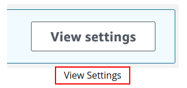
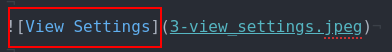

# Udacity Content Maintenance

Standardized formatting to propose content replacements.

## How to Use

1. Go through each folder and see the changes in md files there.
2. I put the image descriptions as image Alts. Look out for them either from inspect element or the Markdown Code directly. For example, this is how the text will show on the site:

  

  That image is available here:

  

## Folder Structure

- The pages are referenced by folders eg. `Course Title (shortened e.g. 'dpa') > Lesson Title > Page Title > Readme.md`.
- Each page directory is self contained. All the content and images are there.

## Page Formatting

- Please see the raw code of this document to understand the code.
- Each change is grouped in a collapsible section. Reasoning: They can be very long, so it's good to have a way to hide them when needed.
- Each change starts with `Change #`.
- Quoted + italic contents are explanations and the rest for updated site content.
- **Ideally, all Markdown code of unquoted parts can be copied directly into the editor.**

For example:

<b>Change 1:</b> Update this part of the content

> *Replace this text:*
>
> ***This is the part written on the page.***

> *with the following:*

This is the new content.

> This quoted text is a part of the new content.

### Additional Notes

- I initially tried using colors and background colors but neither was supported by GitHub Markdown.
- Markdown is not supported inside `
` tags so use HTMLs. For example, `<code>` tags can be used to emulate single backticks e.g.
    

    
<b>Change 1:</b> Both items in the numbered list are <code>1.</code>.

    

