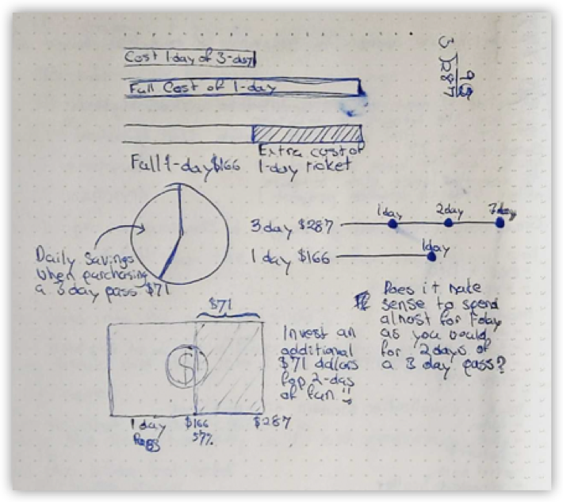
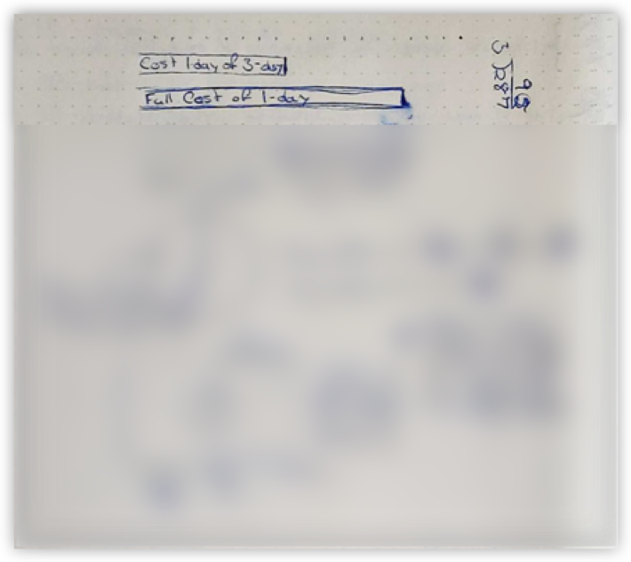
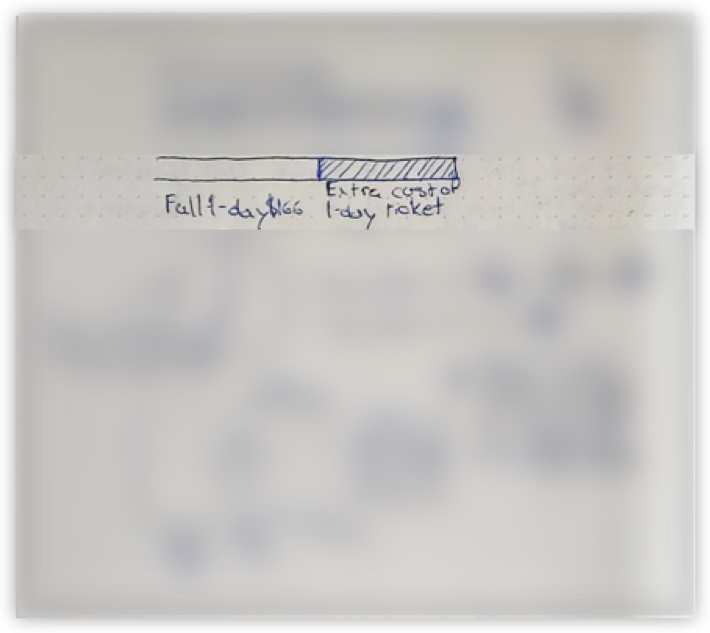
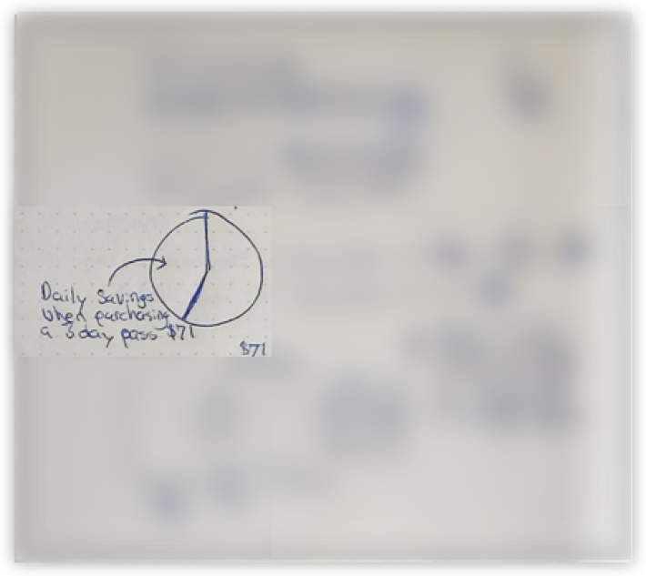
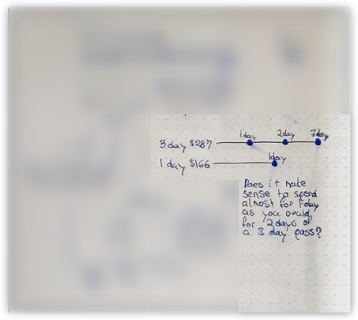
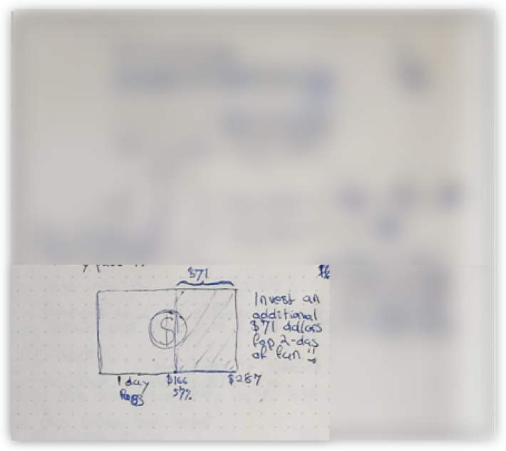

<b>Doodle</b> - Alt text

Hand drawn sketches with visuals and text. In the next few images, we will focus on each sketch.

<b>Detail #1</b> - Alt text

Hand-drawn horizontal bar chart comparing a ⅓ of the 3-day ticket to a full cost of a 1-day pass. The latter is wider than the former.

<b>Detail #2</b> - Alt text

Hand-drawn stacked bar chart emphasizing the extra cost of a 1-day pass vs. ⅓ of the 3-day pass.

<b>Detail #3</b> - Alt text

Hand-drawn pie chart pointing out the savings you realize for a single day when purchasing a 3-day pass vs the 1-day pass, that is $71. This chart shows the same information as the stacked chart earlier, but using a pie instead of two stacked bars.

<b>Detail #4</b> - Alt text

Two hand-drawn lines with points comparing the full 3-day ticket price to the 1-day to show the slight extra amount you’d have to spend to get 3 days at the festival instead of 1

<b>Detail #5</b> - Alt text

A hand-drawn 100% stacked bar chart resembling a dollar bill encourages people to spend the extra $71, viewing it as an investment in their fun. The entire bar represents the price of a 3-day pass, $287. The left part of the bar shows a 1-day ticket price of $166, which is 57% of the total length. Emphasize the right section, which is $71, with a note saying 'Invest an additional $71 for 2-days of fun' next to it.

