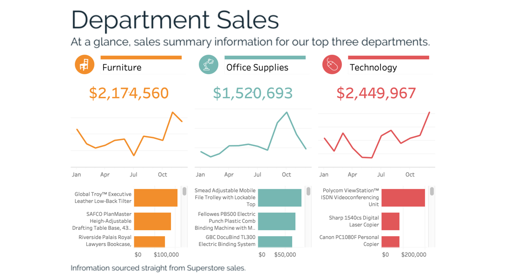

<b>Detail #4</b> - Alt text

Dashboard titled 'Department Sales' showing sales summary information for the top three departments: Furniture, Office Supplies, and Technology. Each section displays the total sales amount, a line chart showing sales trends from January to October, and a bar chart listing the top-selling items.

The Furniture section, marked with an orange icon, shows total sales of $2,174,560. The line chart indicates sales fluctuations throughout the year, with a notable peak in November. Top-selling items include the Global Troy Executive Leather Low-Back Tilter, SAFCO PlanMaster Height-Adjustable Drafting Table Base, and Riverside Palais Royal Lawyers Bookcase.

The Office Supplies section, marked with a teal icon, shows total sales of $1,520,693. The line chart shows a steady increase with a peak in October. Top-selling items include the Smead Adjustable Mobile File Trolley with Lockable Top, Fellowes PB500 Electric Punch Plastic Comb Binding Machine, and GBC DocuBind TL300 Electric Binding System.

The Technology section, marked with a red icon, shows total sales of $2,449,967. The line chart shows significant fluctuations with a peak in December. Top-selling items include the Polycom ViewStation ISDN Videoconferencing Unit, Sharp 1540cs Digital Laser Copier, and Canon PC1080F Personal Copier.

The footer notes that the information is sourced straight from Superstore sales.

