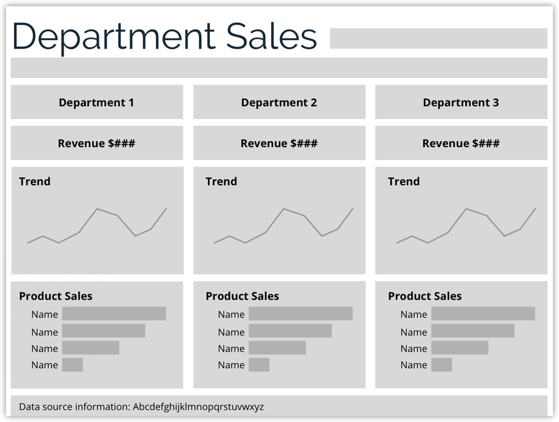

<b>Image</b> - Alt text

Wireframe of a dashboard titled 'Department Sales' showing sections for three departments. Each section includes a placeholder for revenue with the label 'Revenue $###,' a placeholder line chart labeled 'Trend' to show sales trends, and a placeholder bar chart labeled 'Product Sales' listing the top-selling items with labels 'Name' for each item. The layout is divided into three columns, one for each department, with consistent sections for revenue, trend, and product sales. At the bottom, there is a placeholder for the data source information.

