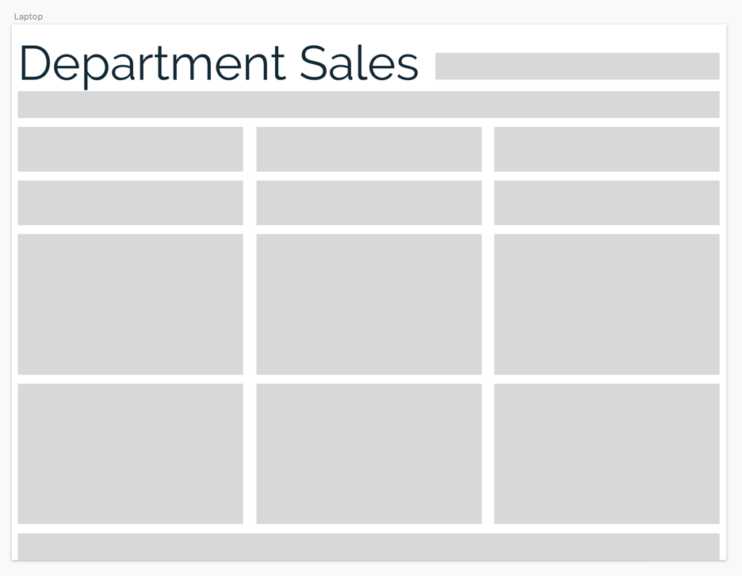
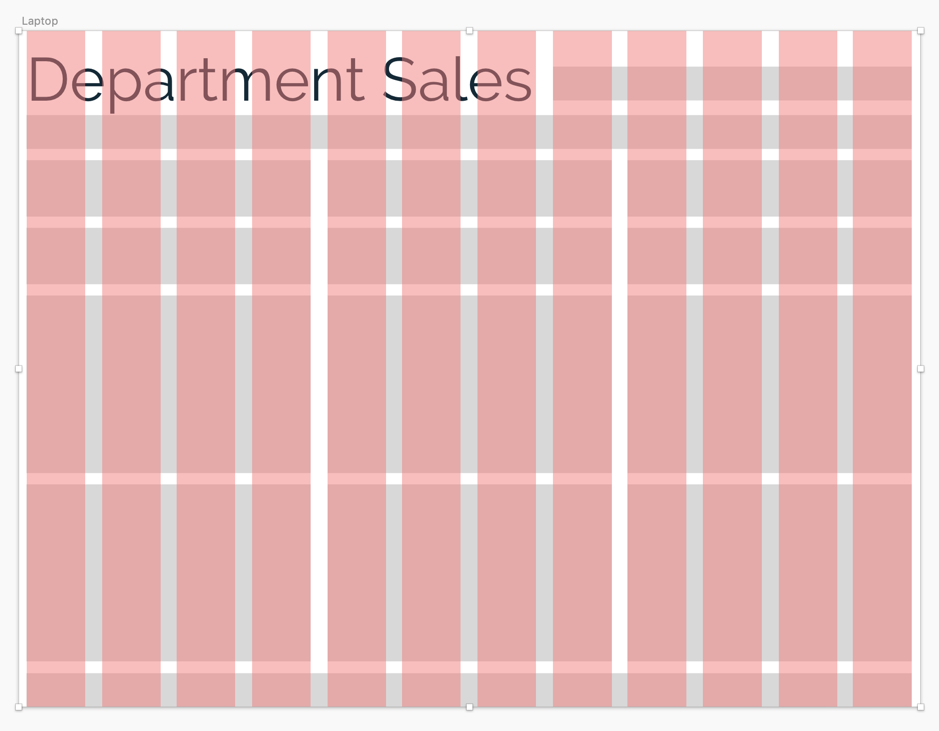
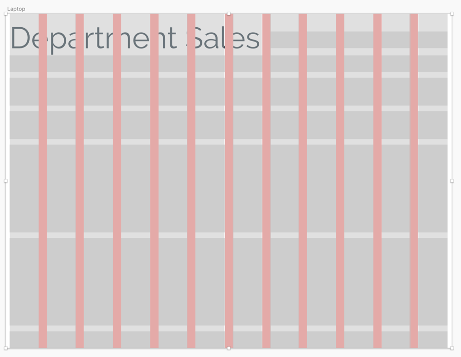
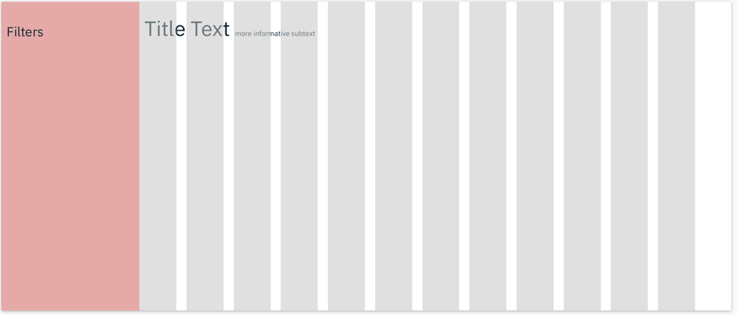

<b>Image #1</b> - Alt text

The layout design of the Department Sales dashboard. It just shows the grey boxes marking all the components in the dashboard.

<b>Image #2</b> - Alt text

Department Sales layout design with 12 pink columns overlaid on top. Each column spans vertically across the screen, with equal spacing between the columns, ensuring they are equally distributed.

<b>Image #3</b> - Alt text

Department Sales layout design overlaid by gutters, filling in the areas between the 12 columns from earlier.

<b>Image #3</b> - Alt text

A margin section placed on the left of the 12-columns structure.

