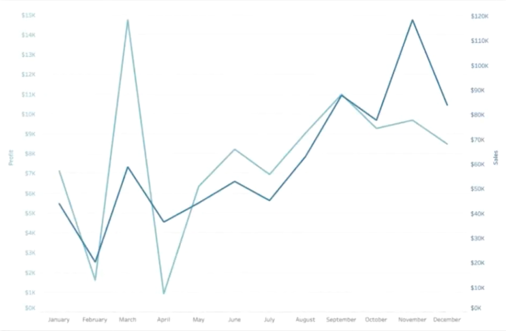

<b>Image #1</b> - Alt text

A line chart and a bar chart as an example of low graphicacy charts. Left: a line chart showing the number of sales on its y-axis and the months on its x-axis. The line shows an uptrend across the months. Right: a bar chart showing the categories on its y-axis and the amount of profit on its x-axis. The amount of profits can be negative, that is why the bars can go to either direction, left or right.

<b>Image #2</b> - Alt text

Medium graphicacy example: Dual-axis line chart displaying profit and sales over a year from January to December. The left y-axis represents profit in dollars, ranging from $0 to $15K, while the right y-axis represents sales in dollars, ranging from $0 to $120K. Two lines indicate the trends: a lighter line for profit and a darker line for sales. Both metrics show fluctuations throughout the year, with significant peaks in March and November and lower values in February and April.

<b>Image #3</b> - Alt text

Medium graphicacy example: Scatter plot showing the relationship between sales and profit. The x-axis represents sales in dollars, ranging from $0 to $35K, and the y-axis represents profit in dollars, ranging from -$4K to $16K. Most data points are clustered around the lower sales and profit values, particularly between $0 and $10K in sales and $0 and $2K in profit. A few outliers exist with higher sales and profit values, including one notable outlier near $35K in sales and $16K in profit.

<b>Image #4</b> - Alt text

Medium graphicacy example: Cumulative measure chart showing the percentage of total running sum of profit for various categories. The x-axis lists categories from left to right: Copiers, Accessories, Phones, Paper, Appliances, Binders, Chairs, Storage, Furnishings, Art, Labels, Envelopes, Fasteners, Bookcases, Supplies, Machines, and Tables. The y-axis represents the percentage of the total running sum of profit, ranging from 0% to 110%. The chart shows a shaded area under a curve that starts low and gradually increases, peaking near the right side, indicating the cumulative contribution of each category to the total profit.

<b>Image #5</b> - Alt text

Medium graphicacy example: Heatmap displaying data across days of the week and months of the year, from January to December. The y-axis lists days of the week from Sunday to Saturday, and the x-axis lists months from January to December. Each cell represents a specific day and month combination, filled with varying shades of blue and some lighter shades. Darker shades are concentrated in the later months, particularly in August to December, and on weekdays. There is no legend, so the specific values or metrics indicated by the color intensity are not provided.

<b>Image #6</b> - Alt text

Medium graphicacy example: Heatmap displaying data across days of the week and months of the year, from January to December. The y-axis lists days of the week from Sunday to Saturday, and the x-axis lists months from January to December. Each cell represents a specific day and month combination, filled with varying shades of blue and some lighter shades. Darker shades are concentrated in the later months, particularly in August to December, and on weekdays. There is no legend, so the specific values or metrics indicated by the color intensity are not provided.

<b>Image #7</b> - Alt text

High graphicacy example: Radar chart displaying the evaluation of a product based on seven criteria: Aroma, Sweetness, Flavor, Body, Acidity, Balance, and After Taste. The chart has concentric circles indicating the scale, with values increasing outward. An orange shaded area and connected points represent the ratings for each criterion, forming a polygonal shape. The ratings suggest that the three highest scores, starting from the highest, are those of Body, Flavor, and Sweetness. The rest are relatively equal.

<b>Image #8</b> - Alt text

High graphicacy example: Treemap showing the distribution of products across different regions. The chart is divided into four colored sections representing the percentage of products sold in 1, 2, 3, or 4 regions. The sections are labeled: 7.4% of products sold in 1 region (blue), 18.8% sold in 2 regions (orange), 37.2% sold in 3 regions (green), and 36.6% sold in 4 regions (purple). Each box within the segments represents an individual product. There is a drop-down menu labeled 'Region to Highlight,' currently set to 'Central'. The result can be used to answer questions like "For products that were sold in two regions, how likely is one of those two regions is the Central region?", or in other words, to infer the likelihood of the Central region being one of the regions where products are sold.

<b>Image #9</b> - Alt text

High graphicacy example: Network diagram showing nodes and connections. Several nodes are connected by lines, forming a loose cluster. The nodes vary in color intensity, with some darker blue and others lighter blue. A cursor is pointing at one of the lighter blue nodes on the lower right side of the cluster.

<b>Image #10</b> - Alt text

High graphicacy example: Error bars, or more commonly called box plot, showing sales data across months from January to December. The y-axis represents sales in dollars, ranging from $0 to $14K. Each month has a box visual displaying the distribution of sales, with box edges representing the interquartile range, lines inside the boxes indicating the median, and whiskers showing the minimum and maximum values. Individual data points are plotted as dots, with some outliers extending beyond the whiskers. Sales tend to increase in variability towards the later months, with notable outliers in March, October, and November.

<b>Image #11</b> - Alt text

High graphicacy example: Connected scatter plot displaying the relationship between speed and distance for the Tour de France over various years. This is similar to a scatter plot, but with the addition of lines connecting the data points to add a time dimension to the chart. The x-axis represents distance, ranging from a minimum of 2,420 km to a maximum of 5,745 km. The y-axis represents speed, ranging from a minimum of 24.05 km/h to a maximum of 41.65 km/h. Each point represents a year of the Tour de France, with points connected by lines to show trends over time. The title 'Le Tour de France' is at the top, and the chart notes it was created by @robcrock with sources Knoema and Wiki. Below the chart, a note says 'Did you know? Hover over a Tour to see Wiki commentary.'

