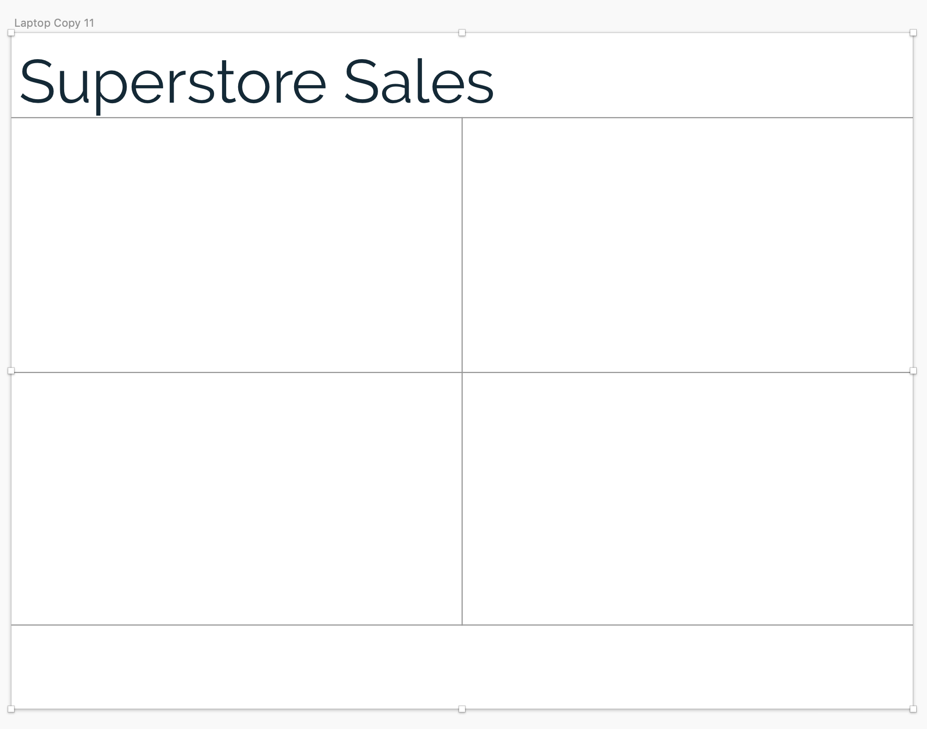
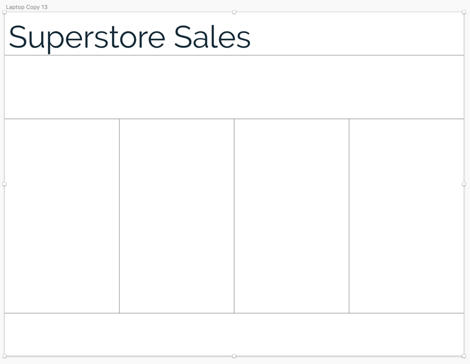
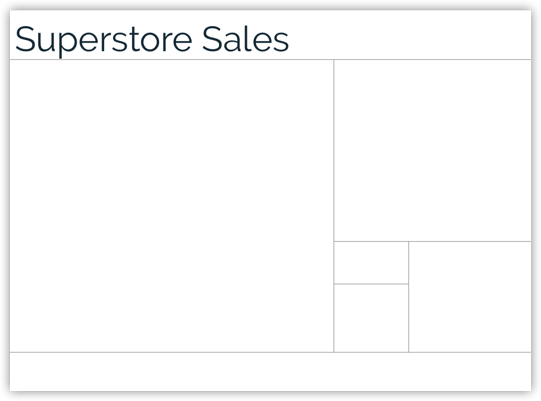

<b>Image #1</b> - Alt text

Layout design featuring a Quadrant style. The title 'Superstore Sales' is at the top left. Below the title, the layout is divided into four equal rectangular sections arranged in a 2x2 grid, with an additional rectangular section spanning the full width at the bottom.

<b>Image #2</b> - Alt text

Layout design featuring a Column style. The title 'Superstore Sales' is at the top left. Below the title, there is another row of section spanning the entire page width. Below this section, the layout is divided into four vertical columns. At the bottom, there is an additional rectangular section spanning the full width.

<b>Image #3</b> - Alt text

Layout design following the Golden Ratio rule. The title 'Superstore Sales' is at the top left. The layouts is drawn like a spiral. The main layout features a large rectangular section on the left and a smaller tall rectangular section on the right. The larger rectangular section takes 62.5% of the entire width. The tall rectangle is also divided into two sections vertically, where the top part takes 62.5% of the height. The bottom rectangle is, again, divided horizontally, and this time the one on the right is larger than the left rectangle. And, finally, the left smaller rectangle is also further divided vertically, where the bottom rectangle takes 62.5% of the remaining height.

