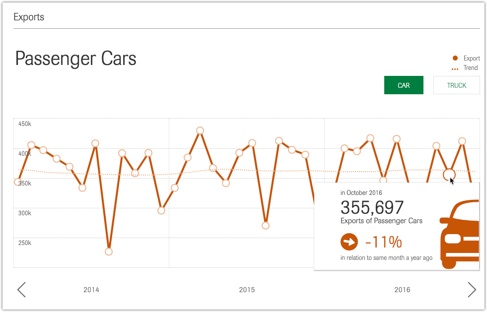
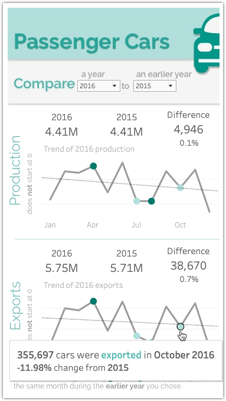

<b>Image #1</b> - Alt text

Line chart showing exports of passenger cars from 2014 to 2016. The y-axis represents the number of cars exported, ranging from 250k to 450k. The chart has an orange line with circles marking data points, representing the monthly export figures, and an orange dotted line indicating the trend. A tooltip highlights October 2016, showing 355,697 exports of passenger cars, a decrease of 11% compared to the same month the previous year. Buttons for 'CAR' and 'TRUCK' are at the top right, with 'CAR' selected. The title 'Passenger Cars' is displayed at the top left.

<b>Image #1</b> - Alt text

Dashboard showing production and export data for passenger cars in 2016 compared to 2015. The top section compares production, showing 4.41 million cars produced in both 2016 and 2015, with a difference of 4,946 cars, or 0.1%. A line chart displays the 2016 production trend from January to December with key data points highlighted. The bottom section compares exports, showing 5.75 million cars exported in 2016 and 5.71 million in 2015, with a difference of 38,670 cars or 0.7%. A line chart shows the 2016 export trend from January to December with key data points highlighted. A highlighted section at the bottom notes the main finding of this dashboard, that 355,697 cars were exported in October 2016, which is an 11.98% decrease from the same month in 2015. Dropdown menus at the top allow the user to select and compare different years.

