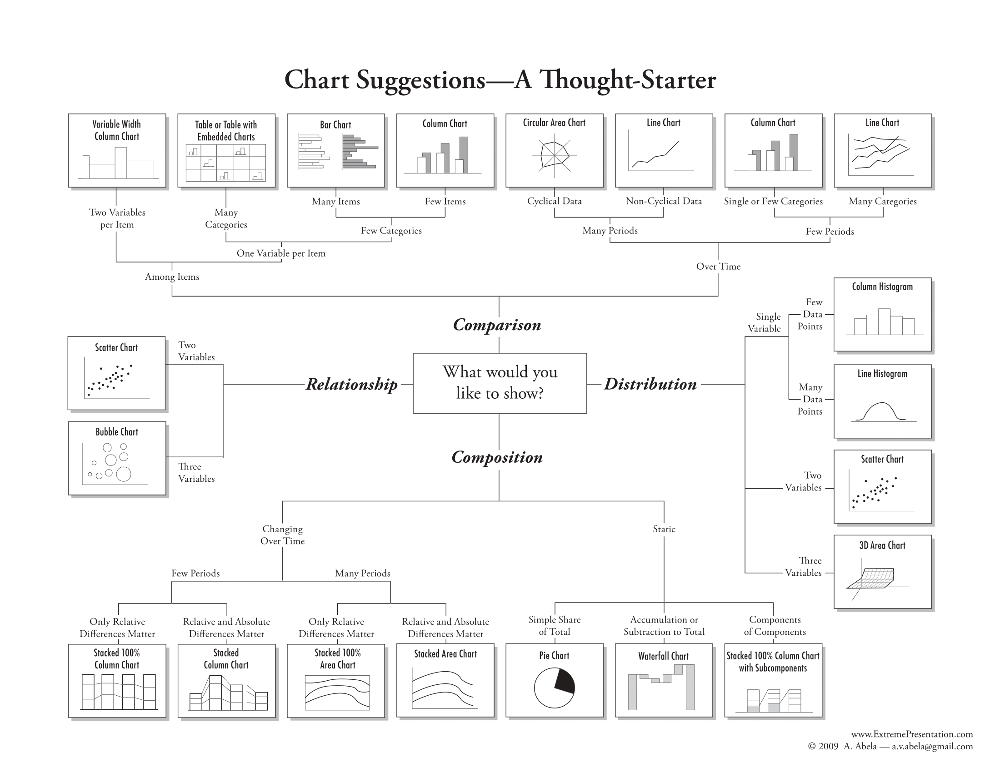
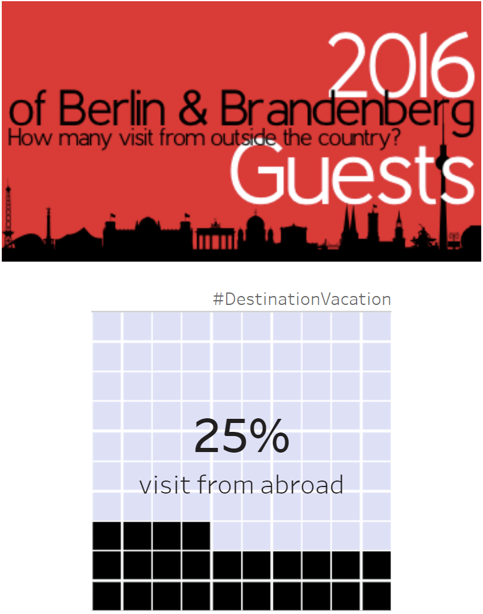
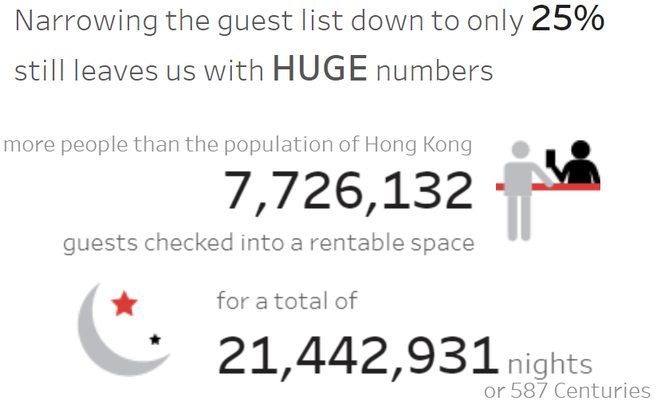
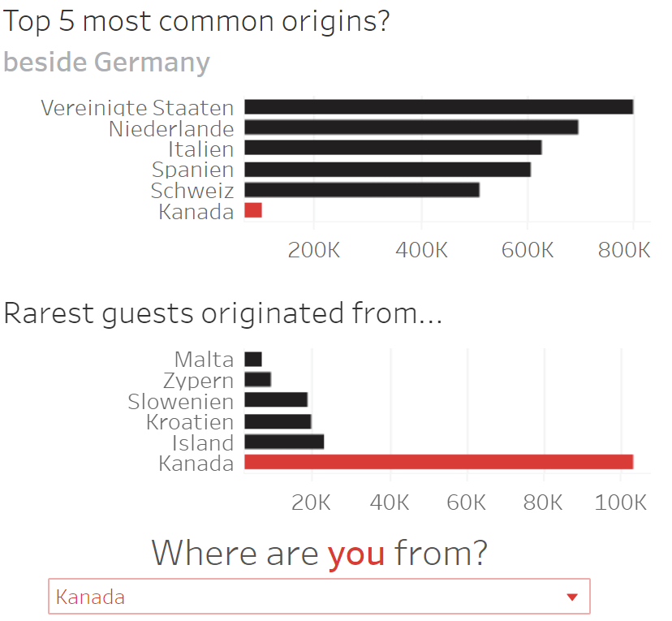

<b>Chart Chooser Diagram</b> - Alt text

Flowchart titled 'Chart Suggestions—A Thought-Starter' presenting various chart types based on data characteristics and what the user wants to show. It categorizes charts for comparing among items, showing relationships, and displaying distributions and compositions over time or statically. Examples include Variable Width Column Chart, Table with Embedded Charts, Bar Chart, Column Chart, Circular Area Chart, Line Chart, Scatter Chart, Bubble Chart, Column Histogram, Line Histogram, 3D Area Chart, Stacked 100% Column Chart, Stacked Column Chart, Stacked 100% Area Chart, Stacked Area Chart, Pie Chart, Waterfall Chart, and Stacked 100% Column Chart with Subcomponents.

<b>Image #1</b> - Alt text

The first part of the dashboard showing the title and the main chart. The chart shows the percentage of visitors from abroad to Berlin and Brandenburg in 2016. The top section has a red background with black silhouettes of various buildings and the text '2016 Guests of Berlin & Brandenberg: How many visit from outside the country?' The bottom section features a grid of 100 squares, with 25 squares filled in black, representing that 25% of the visitors are from abroad. The text '25% visit from abroad' is displayed prominently in the center of the grid, and the hashtag '#DestinationVacation' is at the top of the grid section.

<b>Image #2</b> - Alt text

The second part of the dashboard provides additional context to the earlier chart. This section consists solely of text, illustrating that an informative dashboard may include text-only segments to deliver summaries. The top text reads, "Narrowing the guest list down to only 25% still leaves us with HUGE numbers." Below, it states, "more people than the population of Hong Kong," followed by the number 7,726,132, which represents the population of Hong Kong. Next to this number is an icon of two people, one checking in the other. The bottom section reads, "guests checked into a rentable space for a total of 21,442,931 nights or 587 centuries." To the left of this text is an icon of a crescent moon and two stars, symbolizing nighttime.

<b>Image #3</b> - Alt text

The last part of the dashboard displaying the origins of guests to Germany while allowing readers to interact with it. The interactive part is placed at the bottom so it is harder to miss. The top section shows the 'Top 5 most common origins beside Germany,' with a bar chart listing the United States, Netherlands, Italy, Spain, Switzerland, and Canada, ranging from 200K to 800K, with the United States having the highest count and Canada the lowest. The bottom section highlights the 'Rarest guests originated from...' with a bar chart listing Malta, Cyprus, Slovenia, Croatia, Iceland, and Canada, ranging from 20K to 100K, with Canada having the highest count and Malta the lowest. At the bottom, there is a prompt, 'Where are you from?' with a dropdown menu currently showing 'Kanada'. Changing this input to other countries will change the last bar in both charts, so readers may compare their origin country with other most commmon and rarest origin countries.

