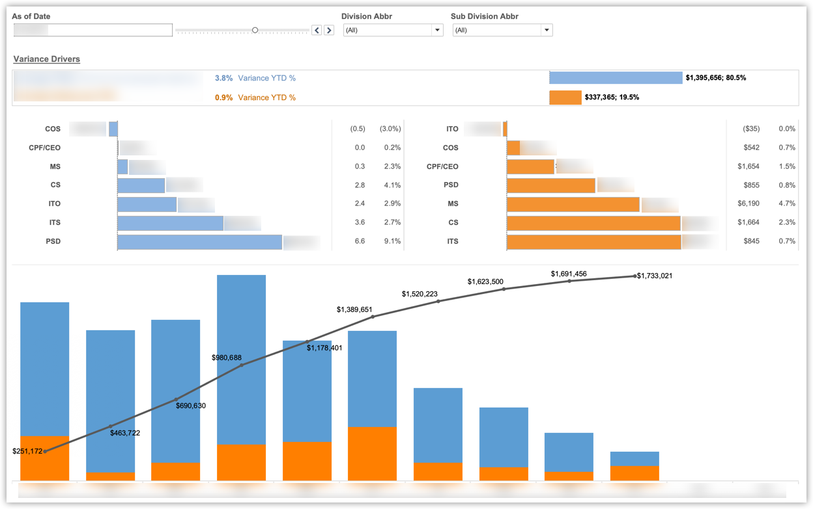
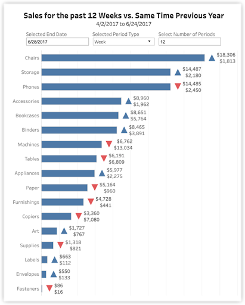
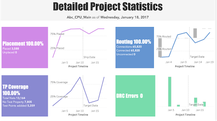
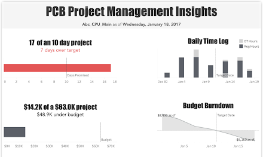

<b>Image #1</b> - Alt text

Dashboard for strategic audiences. The top section shows variance drivers with percentages for year-to-date (YTD) variance. The middle section includes horizontal bar charts displaying the distribution of variances across different categories. The bottom section features a stacked bar chart and a line graph illustrating financial data, with blue bars representing the primary values and orange bars showing additional details. Progress over time is depicted, with labeled financial amounts. Filters for date, division abbreviation, and sub-division abbreviation are available at the top.

<b>Image #2</b> - Alt text

Dashboard showing sales for the past 12 weeks vs same time previous year for different product categories. At the top of this dashboard, right under its title, there are three inputs to update the periods: Selected end date, selected period type, and selected number of periods. Below these inputs, there is a horizontally aligned bar chart that shows the number of sales for the selected period for each category. Right at the end of each bar there is either a blue top facing triangle or a red down facing triangle that represents an increase or decrease in the sales, respectively. Next to the triangles, there are two numbers that are stacked vertically. The top number indicates the number of sales in this period, and the bottom number indicates the number of sales in the same period last year.

<b>Image #3-1</b> - Alt text

The top part of a dashboard for operational audience that contains summary information. The title is PCB Project Management Insights and it is showing four key metrics. The top left section indicates that the project is 17 days into a 10-day project, being 7 days over target. The bottom left section shows a budget of $14.2K spent out of a $63.0K budget, $48.9K under budget. The top right section displays a daily time log with bars representing overtime Hours and regular Hours for dates from December 30 to January 19, and it has an annotation showing the target date on January 11. The bottom right section illustrates a budget burndown chart, which starts at north of $8000 at the beginning of the project on December 30, goes down to 0 on the target date January 11, and goes further down to -$5150 at the end of the project, on January 19.

<b>Image #3-2</b> - Alt text

The bottom part of a dashboard for operational audience that contains detailed information. The title is Detailed Project Statistics and it is showing displaying four key metrics as of Wednesday, January 18, 2017. Top left: Placement at 100.00% with 3,588 placed and 0 unplaced. Top right: Routing at 100.00% with 65,820 connections and 0 unconnected. Bottom left: TP Coverage at 100.00%, with a total of 13,164 net points, 7,805 test points needed, and 3,359 test points added. Bottom right: DRC Errors at 0. Next to each of these metrics there is also a graph showing how the metric changes over time, with the shipping/target date on January 11 annotated.

