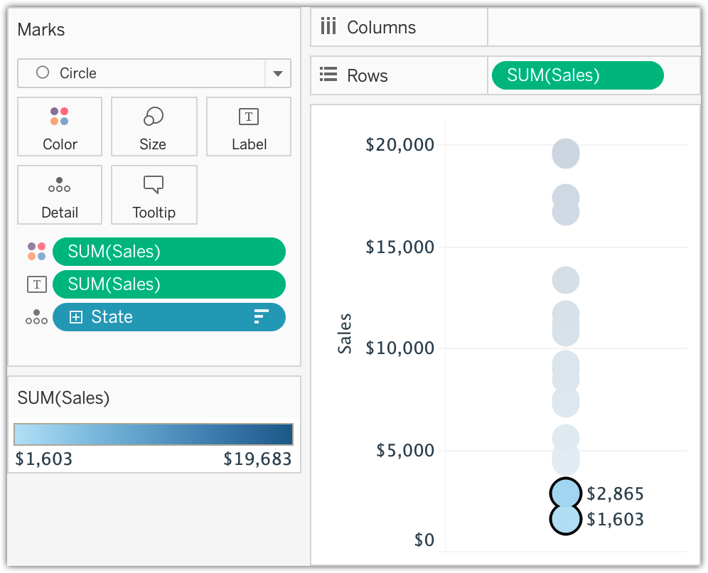
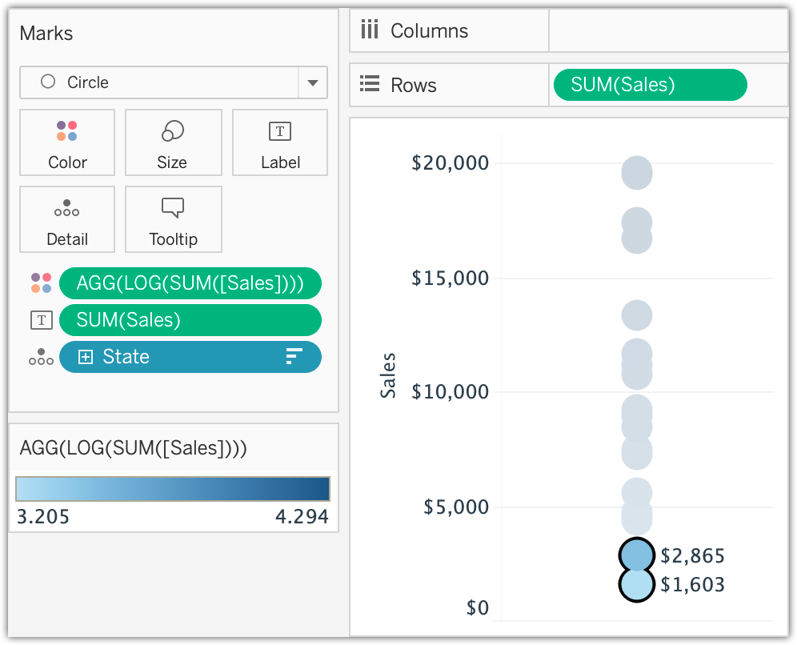

<b>Image #1</b> - Alt text

A screenshot from Tableau shows the color progression on a linear scale. It features a scatter plot with values ranging from $1,603 to $19,683, encoded in light blue for the smaller values to dark blue for the larger values. The color progression is using the SUM of Sales field directly. The two smallest consecutive data points on the scatter plot are highlighted, showing values of $1,603 and $2,865. Notice that the second data point is more than 1.5 times larger than the first data point. However, the color difference between these two is negligible, showing the lightest and nearly lightest blue colors.

<b>Image #1</b> - Alt text

A screenshot from Tableau shows the color progression on a log scale. It features the same scatter plot with values ranging from $1,603 to $19,683, also encoded in light blue for the smaller values to dark blue for the larger values, but this time the color progression is done in log scale by wrapping the SUM of Sales in an AGG of LOG function. In this case, the two smallest consecutive data points, $1,603 and $2,865, are showing a much more visible difference in their colors.

