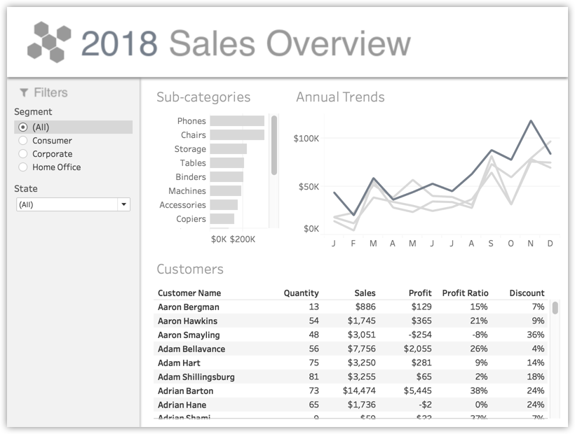
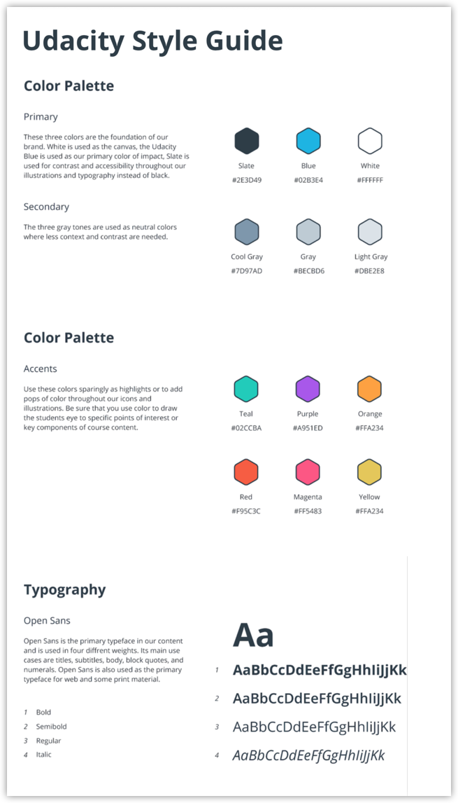
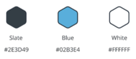
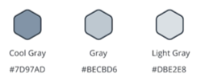
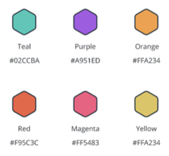
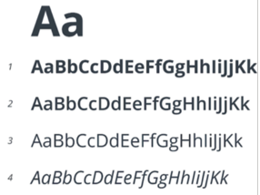

<b>Image #1</b> - Alt text

An uncolorized dashboard titled "2018 Sales Overview." It features filters for segment and state on the left side. The dashboard includes a bar chart displaying sales for various product sub-categories such as Phones, Chairs, and Storage, with values ranging from $0K to $200K. It also shows an annual trends line chart depicting monthly sales from January to December, with values ranging from $0K to $100K. One of the lines is darker than the rest, presumably from the latest year, which is 2018. Below, a table lists customer names, quantities purchased, sales figures, profit, profit ratios, and discount percentages. Examples include customers Aaron Bergman and Aaron Hawkins with their respective sales and profit details. The overall design provides a comprehensive view of sales data for the year 2018.

The existing second image

Replace the existing second image with the following content

<section>
<h3>Udacity Style Guide</h3>
</section>

<section>
<h4>Color Palette</h4>

<section>
<h5>Primary</h5>

These three colors are the foundation of our brand. White is used as the canvas, the Udacity Blue is used as our primary color of impact, Slate is used for contrast and accessibility throughout our illustrations and typography instead of black.

</section>
</section>

Alt text: A palette showing three primary colors along with their hex codes. They are: Slate with the hex code #2E3D49, Blue with the hex code #02B3E4, and white with the hex code #FFFFFF.

<section>
<h5>Secondary</h5>

The three gray tones are used as neutral colors where less context and contrast are needed.

</section>

Alt text: A palette showing three secondary colors along with their hex codes. They are: Cool Gray with the hex code #7D97AD, Gray with the hex code #BECBD6, and light gray hith the ex code #DBE2E8.

<section>
<h5>Accents</h5>

Use these colors sparingly as highlights or to add pops of color throughout our icons and illustrations. Be sure that you use color to draw the students' eye to specific points of interest or key components of course content.

</section>

Alt text: A palette showing six accent colors along with their hex codes. They are: Teal with the hex code #02CCBA, purple with the hex code #A951ED, orange, #FFA234, red, #F95C3C, magenta, #FF5483, and yellow, #FFA234.

<section>
<h4>Typography</h4>
<section>
<h5>Open Sans</h5>

Open Sans is the primary typeface in our content and is used in four different weights. Its main use cases are titles, subtitles, body, block quotes, and numerals. Open Sans is also used as the primary typeface for web and some print material.

</section>
</section>

Alt text: Visual depiction on how Open Sans font looks in Bold, Semibold, Regular, and Italic. For each of the examples, both the capital and lower letters are shown for the letter A to K.

