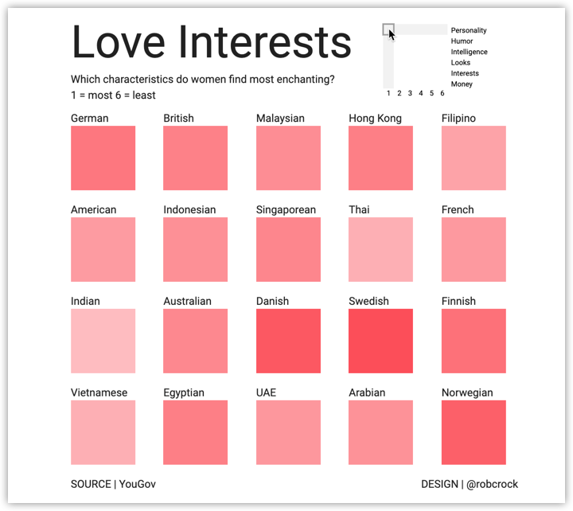
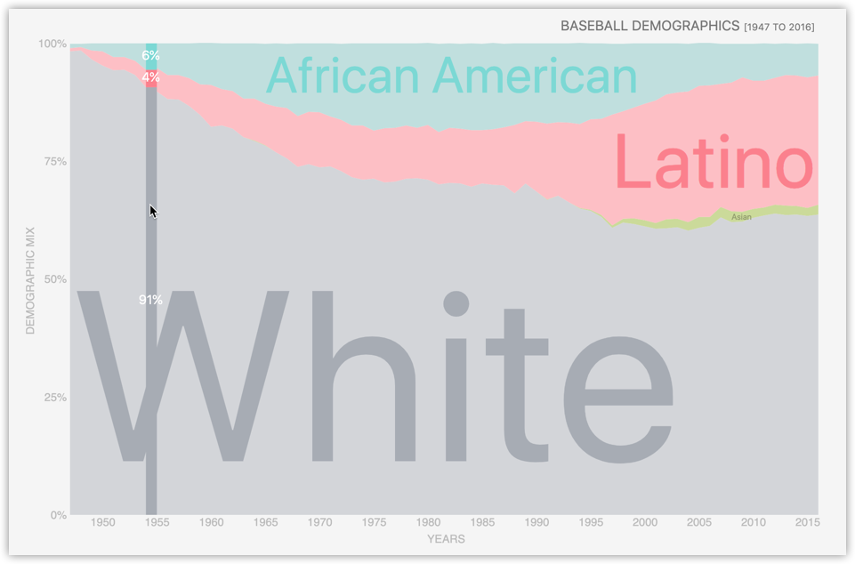
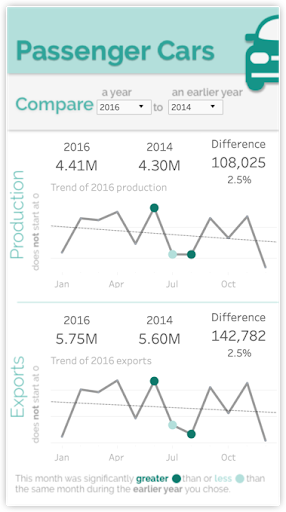

<b>Image #1</b> - Alt text

A chart titled "Love Interests," displaying which characteristics women find most enchanting, rated from 1 (most) to 6 (least). The chart lists various nationalities in a grid format with colored squares representing the average ranking. Nationalities include German, British, Malaysian, Hong Kong, Filipino, American, Indonesian, Singaporean, Thai, French, Indian, Australian, Danish, Swedish, Finnish, Vietnamese, Egyptian, UAE, Arabian, and Norwegian. The top right corner has a small legend indicating that darker red shades represent characteristics rated closer to 1 (most enchanting), and lighter red shades are closer to 6 (least enchanting). The source is YouGov, and the design is credited to @robcrock.

<b>Image #2</b> - Alt text

A chart titled "Baseball Demographics [1947 to 2016]," displaying the demographic mix of baseball players over time. The y-axis represents the demographic mix percentage from 0% to 100%, and the x-axis represents the years from 1947 to 2016. The chart is divided into sections by color: a large gray section labeled "White," a blue section labeled "African American," a pink section labeled "Latino," and a small green section labeled "Asian." In 1950, the chart highlights that 91% of players were White, with 6% African American and 4% Latino. Over the years, the proportion of White players decreases, while the proportions of African American and Latino players increase. The "White" label is the largest and most prominent, followed by "Latino," "African American," and "Asian."

<b>Image #3</b> - Alt text

A screenshot of the passenger cars export data that we've seen in previous lessons. The top section compares production, showing 4.41 million cars produced in both 2016 and 2015, with a difference of 4,946 cars, or 0.1%. A line chart displays the 2016 production trend from January to December with key data points highlighted with green colored circles. The bottom section compares exports, showing 5.75 million cars exported in 2016 and 5.71 million in 2015, with a difference of 38,670 cars or 0.7%. A line chart shows the 2016 export trend from January to December with key data points highlighted. A highlighted section at the bottom notes the main finding of this dashboard, that 355,697 cars were exported in October 2016, which is an 11.98% decrease from the same month in 2015. The colors are used to highlight the findings.

