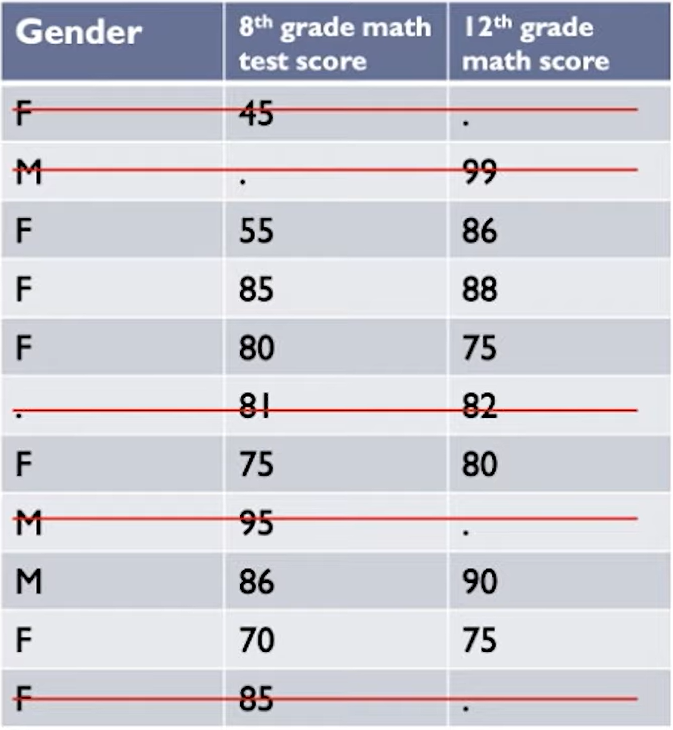

Replace content

Types of missing data

* Random
* Completely random
* Not random

How to address

* Deletion methods
* Imputation methods
* Model-based methods

## Listwise Deletion

Alt text: A table with three columns: "Gender," "8th grade math test score," and "12th grade math test score." The rows contain scores for different students, with missing values represented by dots. Rows with a missing value in either column are crossed out with red lines, indicating they are deleted.

* You choose to only analyze cases with available data on each variable
* Assumes data is MCAR (Missing Completely at Random)
* Advantages:
   * Simplicity
   * Comparable across analyses
* Disadvantages:
   * Reduces statistical power
   * Does not use all info
   * Estimates may be biased if data is not MCAR

## Pairwise Deletion

Alt text: The same table as before. Rather than crossing out the entire row when there is a missing value, the red lines are placed on cells with missing data.

* You choose to analyze with all cases in which the variables of interest are present
* Assumes data is MCAR
* Advantages:
   * Keeps as many cases as possible for each analysis
   * Uses all information possible with each analysis
* Disadvantages:
   * Can't compare analyses because sample is different each time.

For example, if you have a dataset with variables A, B, and C, and you want to calculate the correlation between A and B, pairwise deletion would exclude only the rows where either A or B is missing. If you then want to calculate the correlation between B and C, the rows where either B or C is missing are excluded, potentially resulting in a different subset of the data being used for each pair of variables.

## Mean/Mode Substitution

Alt text: A table in which cells with missing data are highlighted in blue and replaced by the mean of their respective columns.

* Replace missing value with sample mean or mode
* Run analyses as if all complete cases
* Advantage:
  * Can use complete case analysis methods
* Disadvantages:
  * Reduces variability
  * Weakens covariance and correlation estimates in the data (because ignores relationship between variables)

## Regression imputation

* Replaces missing values with predicted score from a regression equation
* Advantage:
  * Uses information from observed data
* Disadvantages:
  * Overestimates model fit and correlation estimates
  * Weakens variance

