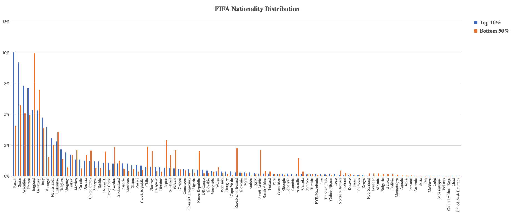

<detail>

<b>Image #1</b> - Alt text

A grouped bar chart titled "FIFA Nationality Distribution." It compares the distribution of nationalities among the top 10% and bottom 90% of FIFA players based on market value. The x-axis lists various countries, while the y-axis represents the percentage of players, ranging from 0% to 13%. The chart uses blue bars to represent the top 10% and orange bars for the bottom 90%. Brazil, Spain, Argentina, and France have the highest representation in the top 10%, while countries like Germany, Italy, and Spain show higher percentages in the bottom 90%.
</detail>