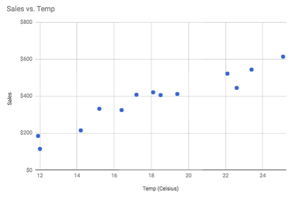
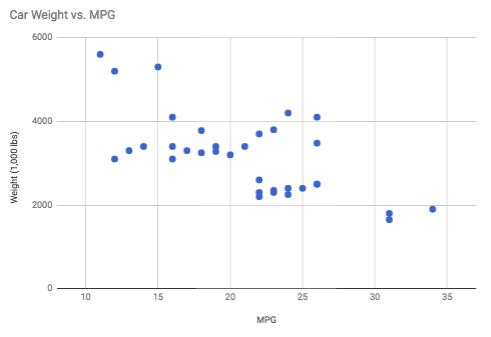
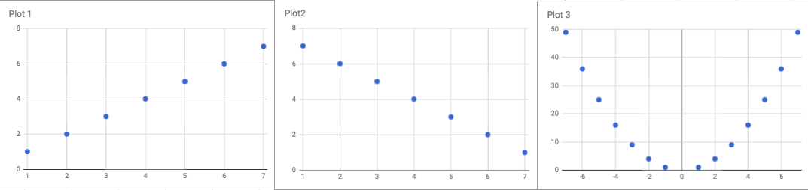

<detail>

<b>Image #1</b> - Alt text

Scatterplot of Temp and Sales that can be generated from the downloadable data above. This scatterplot is titled "Sales vs. Temp" and it shows a strong, positive correlation between temperature in Celsius and sales in dollars. The data points indicate that as the temperature increases, sales also increase consistently. The direction of the trend is upward, suggesting that higher temperatures are associated with higher sales. If we were to calculate the correlation coefficient, it would likely be close to +1, indicating a very strong positive relationship.
</detail>

<detail>

<b>Image #2</b> - Alt text

Scatterplot of MPG and Weight that can be generated from the downloadable data above. This scatterplot is titled "Car Weight vs. MPG" and it shows a moderate negative correlation between car weight in thousands of pounds and miles per gallon (MPG). The x-axis represents MPG, ranging from 10 to 35, while the y-axis represents weight, ranging from 0 to 6000 pounds. The data points indicate that as car weight increases, MPG decreases. The direction of the trend is downward, suggesting that heavier cars tend to have lower fuel efficiency. If we were to calculate the correlation coefficient, it would likely be moderately negative, indicating a noticeable inverse relationship.
</detail>

<detail>

<b>Image #3</b> - Alt text

Three scatterplots from the three datasets available for download above. They are labeled "Plot 1," "Plot 2," and "Plot 3." Plot 1 shows an upward trend, indicating a strong positive correlation where the values increase together. Plot 2 shows a downward trend, indicating a strong negative correlation where one value decreases as the other increases. Plot 3 shows a U-shaped trend, indicating no linear correlation but rather a quadratic relationship, where the values first decrease and then increase.
</detail>