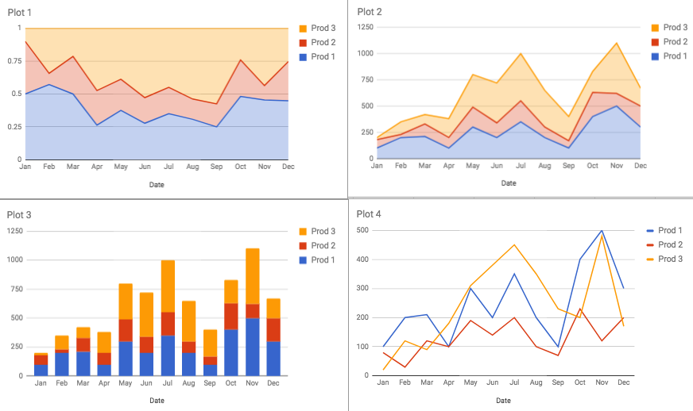

<detail>

<b>Image #1</b> - Alt text

Four different visualizations of the same data are available for download above. Plot 1 is an area chart showing the distribution of three products over time. Plot 2 is another area chart depicting the distribution of the same three products over time. Plot 3 is a stacked bar chart displaying the monthly quantities. Plot 4 is a line chart illustrating the monthly trends for the same three products. Plot 4 allows us to more easily compare the growth of sales since they all use the same scales. Looking at it, we can see that Product 3 had the fastest growth in sales from January to July. If we want to compare the proportion of sales, then a stacked plot that is scaled from 0 to 1, such as Plot 1, is a better option. From this plot, we can see that in February, for example, Product 1's total sales were more than 50% of the total sales of all three products. If we need to find out the total sales of all three products, however, we need to see it from stacked plots where the y-axis uses nominal values, such as Plots 2 and 3. It's clear from these two plots that the total sales of all three products exceeded 1000 units only in November.
</detail>