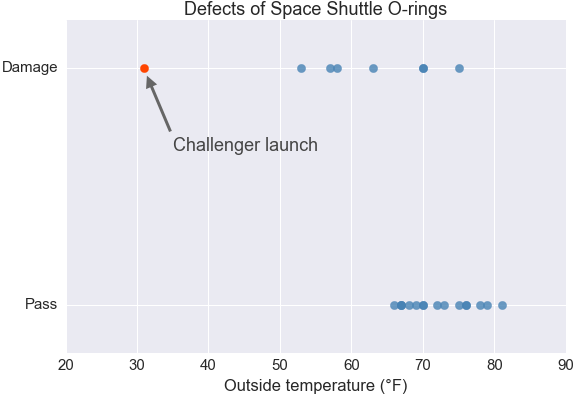

<detail>

<b>Image #1</b> - Alt text

A visual from Fox News with the bar on the left showing 35% and the bar on the right showing 39.6%.
</detail>

<detail>

<b>Image #2</b> - Alt text

Visual of the history of O-Ring damage in field joints showing 12 sets of rockets. Each rocket pair is labeled by numbers, and the first rocket in each pair is labeled A and the second B. The O-ring temperature in Farhenheight is displayed in the upper section of the first rocket in each pair. Some of the rockets have some artifacts without information about what they mean.
</detail>

<detail>

<b>Image #3</b> - Alt text

A scatter plot titled "Defects of Space Shuttle O-rings." It has the x-axis labeled "Outside temperature (°F)" ranging from 20 to 90, and the y-axis labeled "Damage" at the top and "Pass" at the bottom. The plot features multiple blue dots indicating O-ring test results at different temperatures. At around 30°F, there is a single red dot labeled "Challenger launch" with an arrow pointing to it, indicating the temperature at which the Challenger space shuttle launched, highlighting a failure or defect in the O-ring. The other blue dots are clustered at higher temperatures, with no damage indicated.
</detail>
