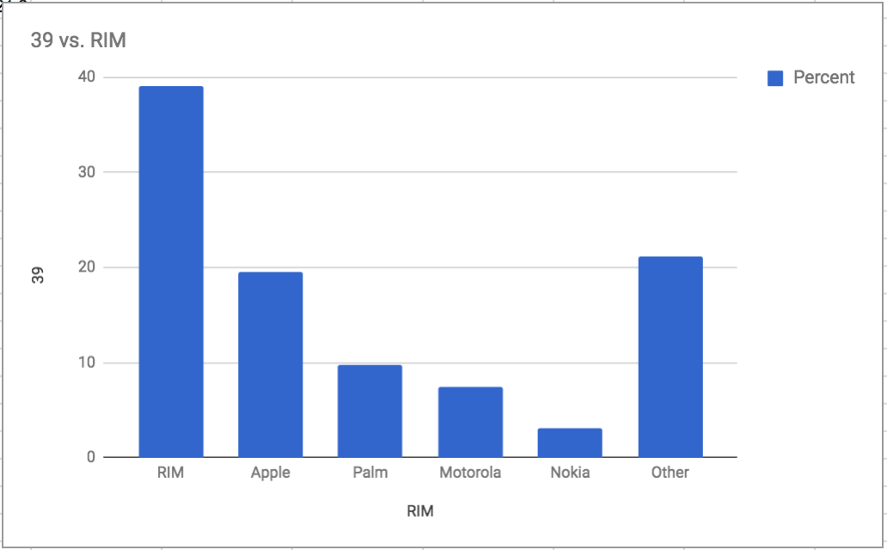
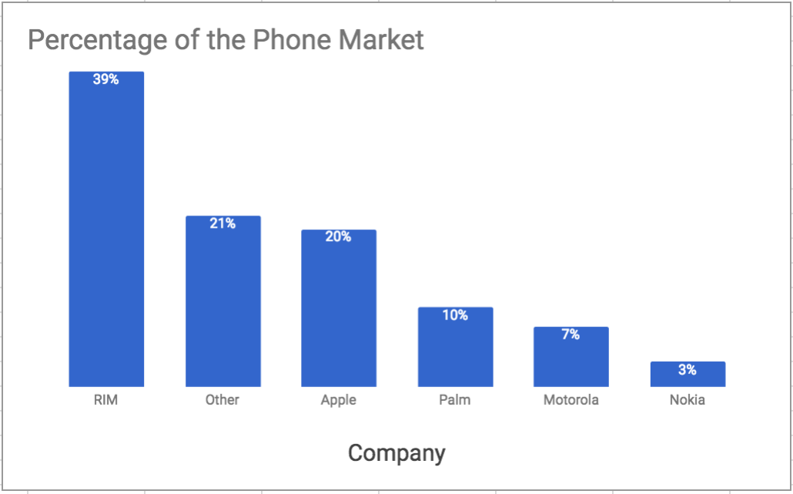

<detail>

<b>Image #1</b> - Alt text

Pie chart of US SmartPhone Market share, shown in an Apple keynote conference by Steve Jobs. The values on the pie chart are as follows: RIM 39%, Apple 19.5%, Palm 9.8%, Motorola 7.4%, Nokia 3.1%, and Other 21.2%. The visual is rendered as a 3-D image which makes the lower parts of the chart look bigger than the values they represent. The pie for Apple is strategically placed at the bottom.</detail>

<detail>

<b>Image #2</b> - Alt text

Bar chart titled "39 vs. RIM." It shows the market share percentages of various phone companies. It has an y-axis labeled "39" with grid lines at 0, 10, 20, 30, and 10. The x-axis labeled "RIM" and seems to encode company names. The companies and their respective y-axis values are: RIM at slightly below 40%, Apple at slightly below 20%, Palm at very slightly below 10%, Motorola at around 7%, Nokia at around 3%, and Other at a bit above 20%.There is also a legend showing a blue box labeled "Percent".
</detail>

<detail>

<b>Image #3</b> - Alt text

A revised bar chart. The title is now "Percentage of the Phone Market". The bars are now ordered from the largest to smallest percentages. The y-axis was removed, but in place of it the chart shows the exact percentage value at the top of each bar, which shows, in order, RIM 39%, Other 21%, Apple 20%, Palm 10%, Motorola 7%, Nokia 3%. The X-axis is labeled "Company". The legend, which did not add any information value, was removed from the chart.
</detail>