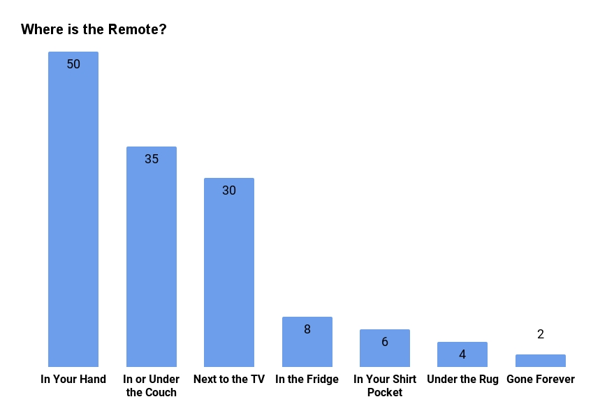

<detail>

<b>Image #1</b> - Alt text

Bar chart titled "Count vs. Where" with a red background. The x-axis is labeled "Where," and the y-axis is labeled "Count." The chart displays the number of occurrences (Count) of items in various locations (Where). The locations and their corresponding counts are as follows: "In Your Hand" with a count of around 47, "In or Under the Couch" with about 35, "Next to the TV" with around 30, "In the Fridge" with about 8, "In Your Shirt Pocket" with about 7, "Under the Rug" with about 6, and "Gone Forever" with about 4. The bars are blue, and a legend indicates that the blue bars represent "Count."
</detail>

<detail>

<b>Image #2</b> - Alt text

Bar chart titled "Where is the Remote?" with a white background. The x-axis is labeled with different locations, and the y-axis is labeled with numerical values representing the count. The locations and their corresponding counts are as follows: "In Your Hand" with a count of 50, "In or Under the Couch" with 35, "Next to the TV" with 30, "In the Fridge" with 8, "In Your Shirt Pocket" with 6, "Under the Rug" with 4, and "Gone Forever" with 2. The bars are light blue, and the counts are displayed at the top of each bar.
</detail>