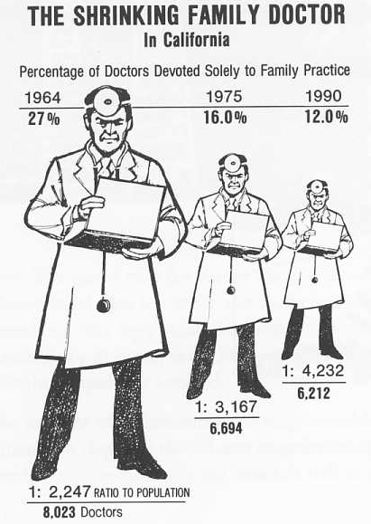

<detail>

<b>Image #1</b> - Alt text

A black-and-white infographic titled "The Shrinking Family Doctor in California," showing the decline in the percentage of doctors devoted solely to family practice from 1964 to 1990. It includes three cartoon-like doctors holding medical bags, each progressively smaller to depict the decrease. In 1964, 27% of doctors were family practitioners (8,023 doctors, 1:2,247 ratio to population). In 1975, this dropped to 16% (6,694 doctors, 1:3,167 ratio). By 1990, only 12% were family practitioners (6,212 doctors, 1:4,232 ratio). The sizes of the doctor images shrink more significantly compared to the actual percentage decreases, which gives an outsized impression of the impacts.
</detail>