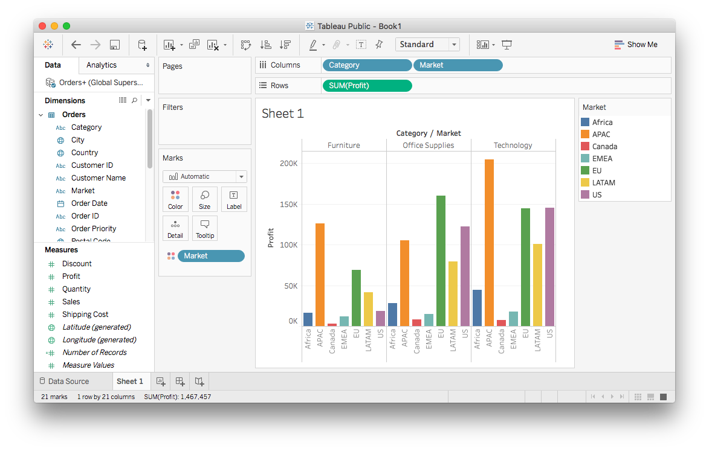

<detail>

<b>Image #3</b> - Alt text

The graph created after clicking on side-by-side bars in the Show Me tab. It now shows a grouped bar chart, with profit as the y-axis and market regions as the x-axis. The chart is divided into three categories: Furniture, Office Supplies, and Technology. Each category is divided further into 7 market regions, Africa, APAC, Canada, EMEA, EU, LATAM, and US. Each market region has its own designated color.
</detail>