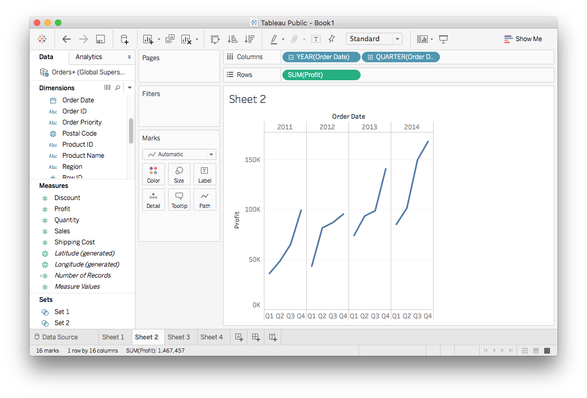
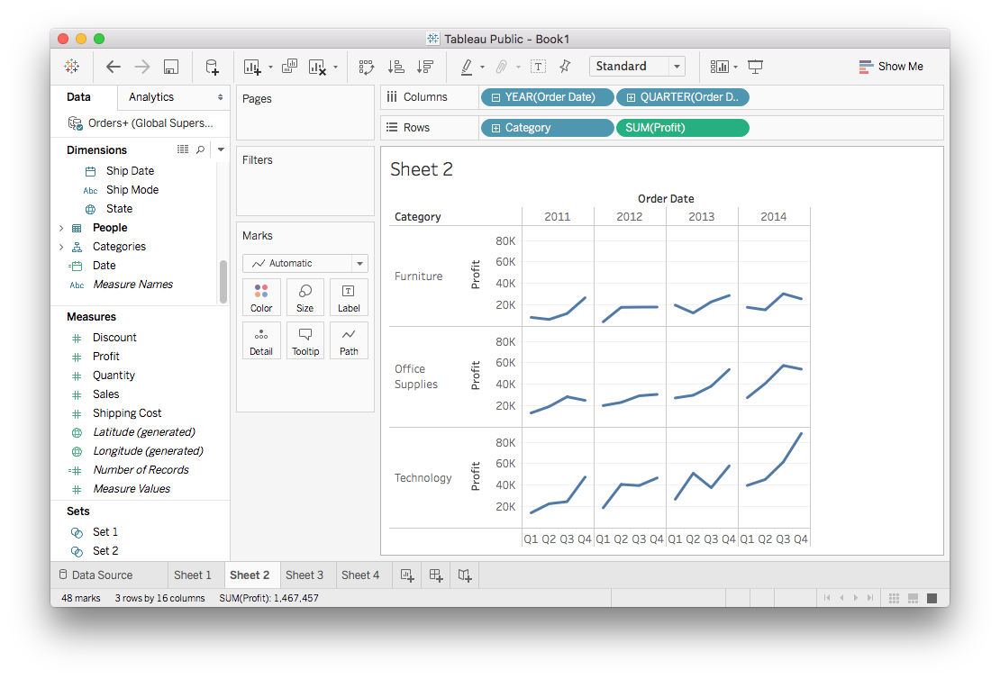
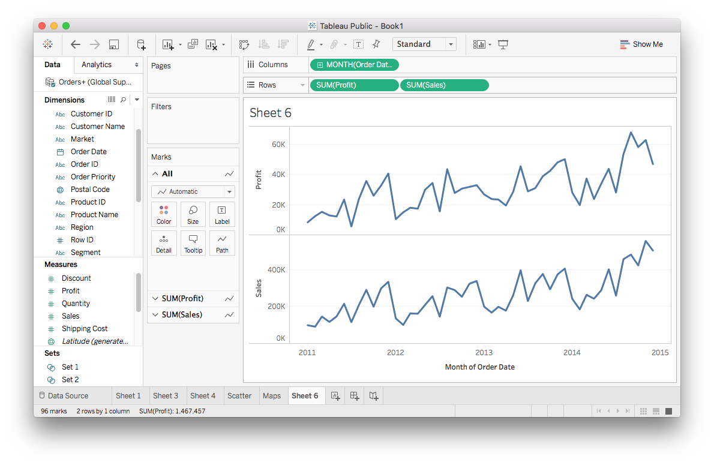
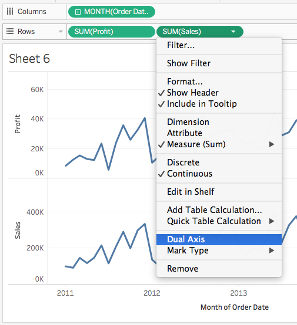
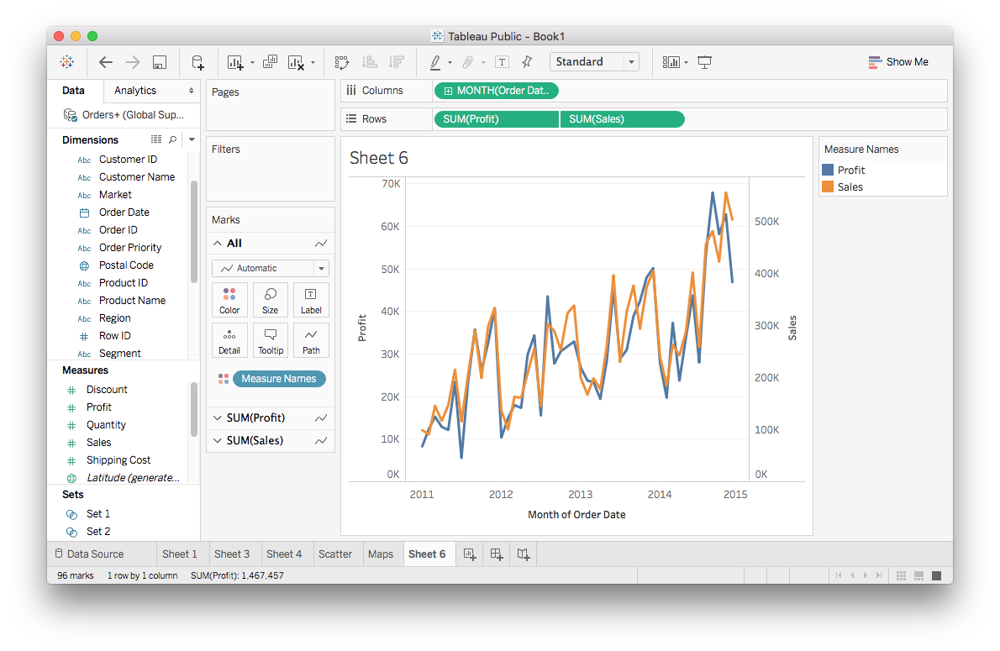

<detail>

<b>Image #1</b> - Alt text

An example of a small multiple graph. It is a simple line chart with profit on its y-axis and order date on its x-axis. The data is sliced into four line charts, one for each year, and in each year, it shows Q1 to Q4 in the x-axis.
</detail>

<detail>

<b>Image #2</b> - Alt text

Small multiples after dragging Category to the Rows shelf. The chart is further divided by categories. Since there are three categories and four years, we end up with 12 smaller line charts.
</detail>

<detail>

<b>Image #3</b> - Alt text

How the chart looks after dragging both Profit and Sales to the Rows shelf. There are two line charts in this figure, one for each field. There are two separate y-axes that are stacked vertically; One for Profit, and another for Sales.
</detail>

<detail>

<b>Image #4</b> - Alt text

The menu on one of the SUM of Sales measure pill with "Dual Axis" highlighted. 
</detail>

<detail>

<b>Image #5</b> - Alt text

A chart with a dual axis. After selecting Dual Axis, both line charts are drawn in a single figure and the y-axes of these charts were both drawn on the left and right of the figure. The lines are also encoded with different colors, blue for Profit and orange for Sales.
</detail>

<detail>

<b>Image #6</b> - Alt text

Alternatively, you may also drag the second measure on the right side of the screen to get both lines on the same plot. The area of the second y-axis is highlighted as we drag the measure on it.
</detail>