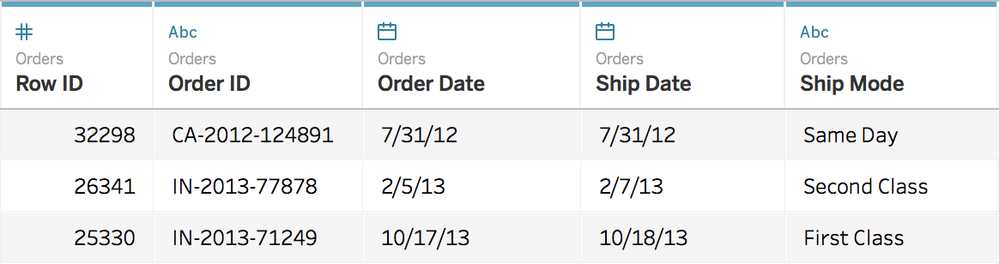

<detail>

<b>Image #4</b> - Alt text

The headers as well as the icons that indicate the type of data in the column. From the left, the columns and their data types are: Row ID, numeric; Order ID, text; Order date, date; Ship date, date; and Ship mode, text. The icon for the numeric data type is a hash, for the text is three letters A B C, and for date is a calendar.
</detail>