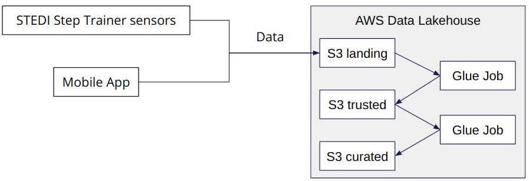
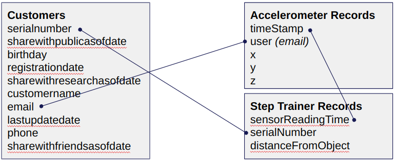

# Changes to the [Project Instructions](https://learn.udacity.com/nanodegrees/nd027/parts/cd12441/lessons/b872a5b3-25f5-436a-bf68-c2c35a1ec626/concepts/a9b97ccf-af67-4e99-a10e-41f06ecb15f5) Page

> Include the following content just under the **Project Instructions** section right above the **Requirements** section:

> Include the following content at the very bottom of the page before the **Check your work!** section:

The following diagram shows how the tables in this project should be mapped:

