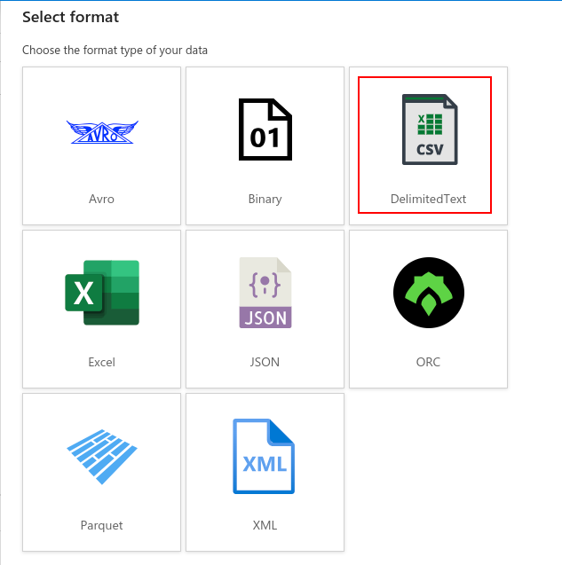
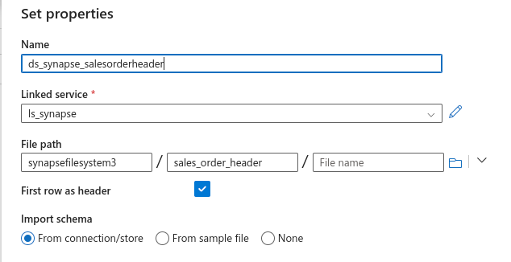

<details open>
<summary></b>Change 1:</b> Replace the last sentece of CETAS description</summary>

> *Existing description:*
> ***CETAS creates external tables and exports the SELECT query results to a set of files in your storage account.***

> *Replace it with:*

CETAS creates external tables that ingest data from files in your storage account.

</details>

<details open>
<summary></b>Change 2:</b> Replace the content underneath CETAS description to the following</summary>

[VIDEO](https://drive.google.com/file/d/1kmr90Y50VHSXn_7zIWhWb68qsuVeu-b0/view?usp=sharing)

After you have created these tables, you may create tables in your Data Factory. Before that, however, you need to download some sample data from SQL DB to be used as a data schema for the Synapse tables. Remember that Synapse data are stored in a blob storage that is currently empty except for empty directories `sales_order_header` and `customer`. Connect to your SQL DB, run each of these two queries, and store the output in your local computer:

```
SELECT * FROM SalesOrderHeader LIMIT 100;
SELECT * FROM Customer LIMIT 100;
```

## Create Datasets in Data Factory

You will need to create four datasets:
- `ds_sqldb_salesorderheader` that connects to the SQL DB's SalesOrderHeader table.
- `ds_sqldb_customer` that connects to the SQL DB's Customer table.
- `ds_synapse_salesorderheader` that connects to `sales_order_header` directory of `synapsefilesystem1` container in `synapsestorageacct1` storage.  
- `ds_synapse_customer` that connects to `customer` directory of `synapsefilesystem1` container in `synapsestorageacct1` storage.

### Creating Synapse Analytics Datasets

When setting up the connections to Synapse Analytics, choose **AzureBlobStorage** > **Delimited Text**.



And the file paths must point to the appropriate directories.



In each of these datasets, click on "Import Schema" and use the CSV files you have downloaded from the previous steps (one file that contained 100 rows from the SalesOrderHeader table and another that contained 100 rows from the Customer table). Once you have the schemas imported, you may publish the datasets to save your work.

---

The following video shows how you can connect datasets to your tables if you're going the dedicated pool route. If you're using Udacity federated account, you may watch the first half of the video that provides you guidance on how to connect to the SQL DB tables. And then, rather than connecting to Synapse Analytics, you need to instead connect to Azure Blob storage as instructed above.

</details>

<details open>
<summary></b>Change 3:</b> Move the existing video from the top to the bottom of the page</summary>

</details>


