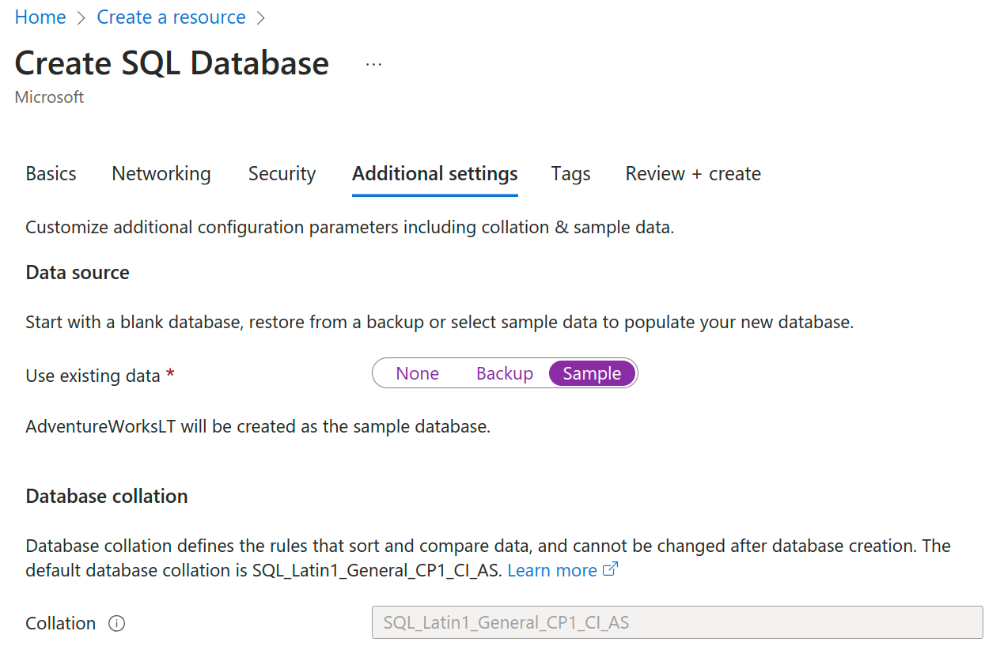

<details open>
<summary><b>Change 1:</b> Replace the entire page with the following content.</summary>

> **Test 1**
>
> *Test 2*
>
> Test 2

In this exercise, you'll create the Azure resources necessary to build data pipelines throughout the course. 

You'll need Contributor, Data Factory Contributor and Storage Blob Contributor roles on the Resource Group. These roles have already been granted to your Udacity federated account.

**Make sure you create all your resources within the same Azure region.**

**Step 1.** Create an Azure SQL Database in Azure Portal. This database will used throughout this course for various exercises.

**Select Sample database under Additional settings.** This database will be used throughout this course. Use Query Editor in the Azure Portal or SQL Server Management Studio to make sure the sample database is created, and you can query the tables SalesOrderHeader and Customer from the `SalesLT` schema.



**Step 2.** Create Synapse Analytics Workspace. Then create SalesOrderHeader, Customer tables with similar structure from the above SQL DB.

Take note of the **filesystem** name that you used:

[Take note of the **filesystem** name of your storage](storage.png)

Synapse Analytics will need to store the data in 

You'll need these SQL Scripts: 

```
CREATE TABLE SalesOrderHeader(
    [SalesOrderID] [int] NOT NULL,
    [RevisionNumber] [tinyint] NOT NULL,
    [OrderDate] [datetime] NOT NULL,
    [DueDate] [datetime] NOT NULL,
    [ShipDate] [datetime] NULL,
    [Status] [tinyint] NOT NULL,
    [OnlineOrderFlag] [BIT] NOT NULL,
    [SalesOrderNumber]  [nvarchar](23) not null,
    [PurchaseOrderNumber] [nvarchar](23) NULL,
    [AccountNumber] [nvarchar](23) NULL,
    [CustomerID] [int] NOT NULL,
    [ShipToAddressID] [int] NULL,
    [BillToAddressID] [int] NULL,
    [ShipMethod] [nvarchar](50) NOT NULL,
    [CreditCardApprovalCode] [varchar](15) NULL,
    [SubTotal] [money] NOT NULL,
    [TaxAmt] [money] NOT NULL,
    [Freight] [money] NOT NULL,
    [TotalDue]  [money] NULL,
    [Comment] [nvarchar](1000) NULL,
    [rowguid] [uniqueidentifier] NOT NULL,
    [ModifiedDate] [datetime] NOT NULL
)

CREATE TABLE Customer(
    [CustomerID] [int] NOT NULL,
    [NameStyle]  [bit] NOT NULL,
    [Title] [nvarchar](8) NULL,
    [FirstName] [nvarchar](128) NOT NULL,
    [MiddleName] [nvarchar](20) NULL,
    [LastName] [nvarchar](128) NOT NULL,
    [Suffix] [nvarchar](10) NULL,
    [CompanyName] [nvarchar](128) NULL,
    [SalesPerson] [nvarchar](256) NULL,
    [EmailAddress] [nvarchar](50) NULL,
    [Phone] [nvarchar](20) NULL,
    [PasswordHash] [varchar](128) NOT NULL,
    [PasswordSalt] [varchar](10) NOT NULL,
    [rowguid] [uniqueidentifier] NOT NULL,
    [ModifiedDate] [datetime] NOT NULL
)

```

**Note:** Notice that the password fields are using `varchar` while the other strings `nvarchar`. The former accepts text data from only a single language, while the latter supports multilingual text data.

2. Create an Azure Data Lake Gen 2 storage account, 1 container, and 1 directory called Staging. This Staging folder will be used while creating the pipelines.
2. Create a Data Factory V2 resource in the Azure Portal.

</details>