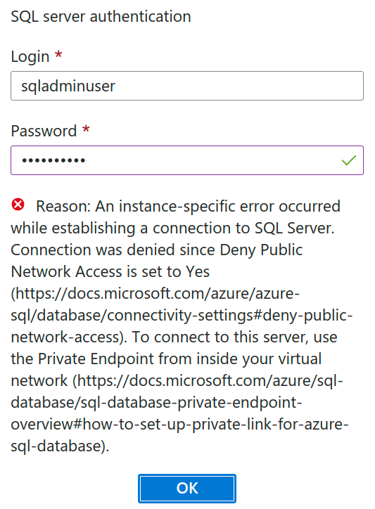
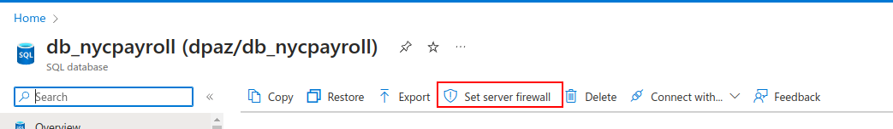
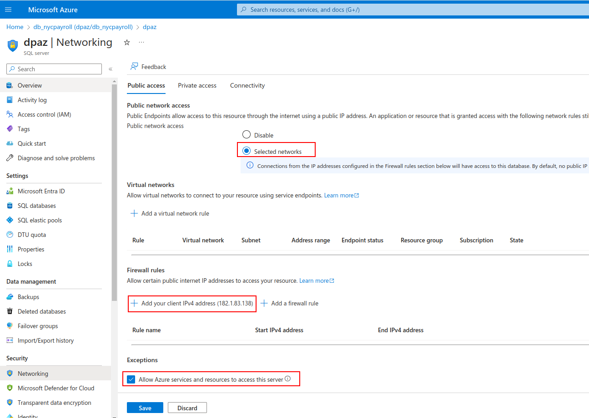

<b>Change 1:</b> Change the ordering of sections

> *The ordering of details must follow the instructions in the previous page, that is:*

> 1. *SQL DB*
> 2. *Storage Account*
> 3. *Data Factory*
> 4. *Synapse Analytics*
> 5. *External Tables*

<b>Change 2:</b> Right </b>after</b> the SQL DB creation video, add the following content:

**Allowlist IP ...** link may not show in your Query Editor and you get the following message instead:

To fix this, you need to enable public network access from the **Networking** option. First, go to the overview of your SQL database, and click on the **Set server firewall** link:

Then, enable public network access to your database server and add your computer's IP address. You also need to enable the **Allow Azure services and resources to access this server** option since we will need to do that later in this project:

<b>Change 3:</b> Remove <b>Using Synapse workspace in Udacity Cloud Labs</b> in the Data Factory section above

> *The text is located above the text that says **As part of the recent updates to the Udacity cloud labs, your Data Factory resource will be deleted automatically after certain hours if left idle.** *

<b>Change 4:</b> Add the following content under the Data Lake Storage creation video
 

Notes:

* In the new Azure version, **Data Lake Storage Gen2** section is replaced by **Hierarchical Namespace**.
* **This step is optional** since you may also use the storage account created by Azure Synapse Analytics

</b>Change 5:</b> Replace the last sentence of CETAS description

> *Existing description:*
> ***CETAS creates external tables and exports the SELECT query results to a set of files in your storage account.***

> *Replace it with:*

CETAS creates external tables that ingest data from files in your storage account.

</b>Change 6:</b> Add the following content after the CETAS description:</b>

The above video shows you how to create and use a **Dedicated SQL Pool** within Azure Synapse Analytics. If you are using Udacity federated user account, you only need to follow the video up until 2:45. You will create the SalesOrderHeader later, during the *Create Datasets* process.

<b> Change 7:</b> Update the titles to follow the steps mentioned in the previous page

