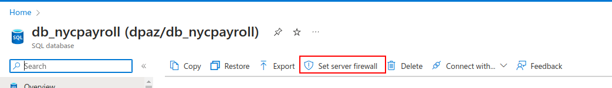
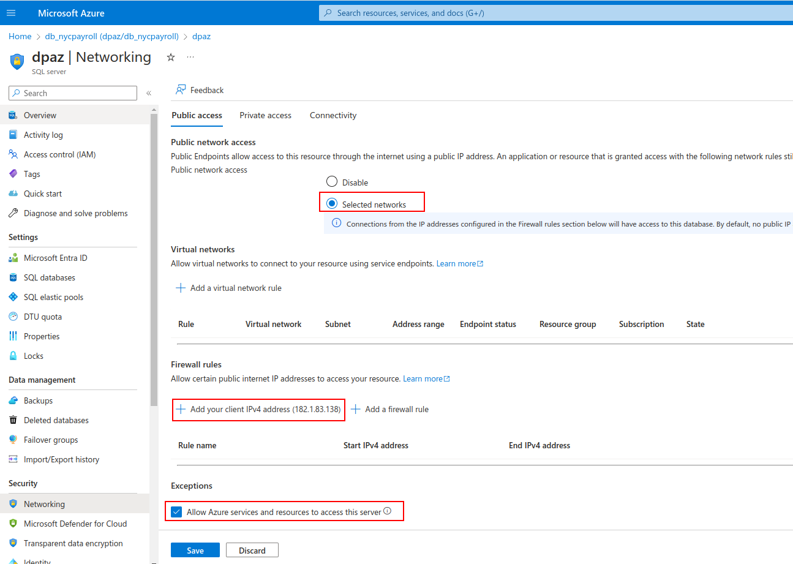

> Right **above** the heading **Creating a Synapse Analytics Workspace:**, add the following content:

If the **Allowlist IP ...** link does not show in your Query Editor, you need to enable public network access from the **Networking** option. First, go to the overview of your SQL database, and click on the **Set server firewall** link:

and then, enable public network access to your database server and add your computer's IP address. Also enable the "Allow Azure services and resources to access this server" option since we will need to do that later in this project:

