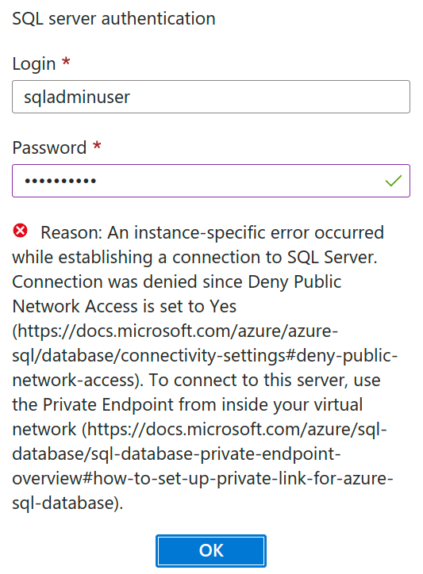

<b>Change 1:</b> Right </b>above</b> the heading Creating a Synapse Analytics Workspace:, add the following content:

**Allowlist IP ...** link may not show in your Query Editor and you get the following message instead:

To fix this, you need to enable public network access from the **Networking** option. First, go to the overview of your SQL database, and click on the **Set server firewall** link:

Then, enable public network access to your database server and add your computer's IP address. Also, enable the **Allow Azure services and resources to access this server** option since we will need to do that later in this project:

