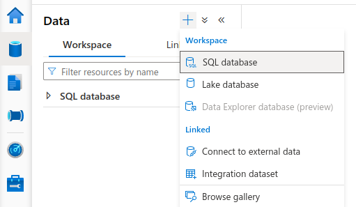
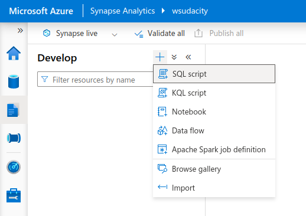
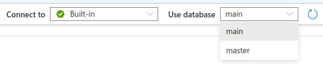

> (Optional) Change 1: add the following note to help students completing this project
> Right under the sentence "Setup Data and Resources in Azure", add the following tip:

The actions in this step are covered in the **Azure Data Pipeline Components** lesson.

> Change 2: Add the following right below **5. Create master data tables and payroll transaction tables in Synapse Analytics workspace** before the first item.

- First, create an SQL database from the **Data** > **Workspace** menu:

  

- From the **Develop** menu, create a new SQL script:

  

  Don't forget to pick the database  you've just created:

  

- Then run the following code in the SQL script.

> Change 3: Replace the content just below the **Define the data source to persist the results.** section.
> (The current content is VERY confusing as `mydls20230413` is used as both the storage and file system names):

```
-- Storage path where the result set will persist
IF NOT EXISTS (SELECT * FROM sys.external_data_sources WHERE name = 'dirstaging_adlsnycpayroll_dfs_core_windows_net')
    CREATE EXTERNAL DATA SOURCE [dirstaging_adlsnycpayroll_dfs_core_windows_net]
    WITH (
        LOCATION = 'abfss://dirstaging@adlsnycpayroll.dfs.core.windows.net'
    )
GO
```

**Use the blob storage account name as applicable to you.** In the snippet above, `adlsnycpayroll` is the Data Lake Gen 2 storage name, and `dirstaging` is the name of the file system (container).
