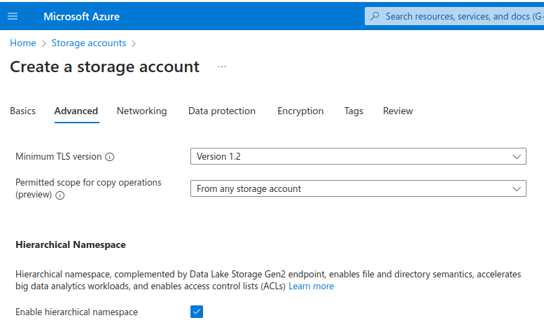
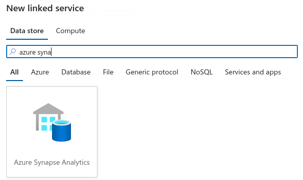
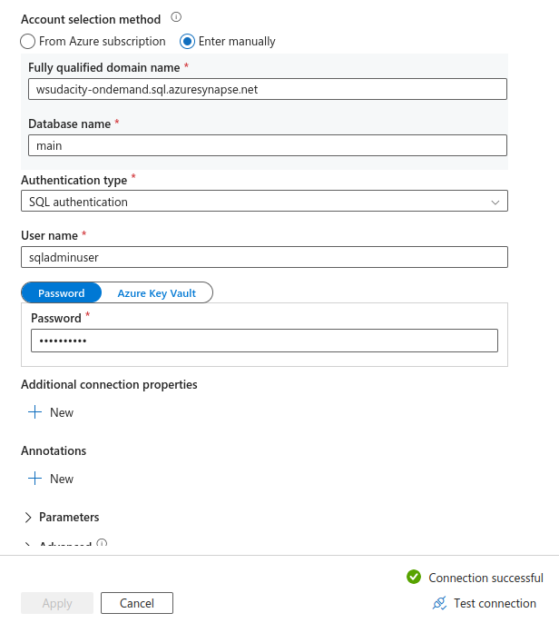
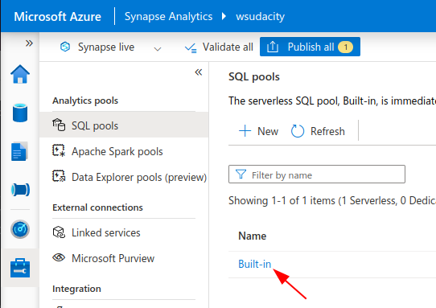
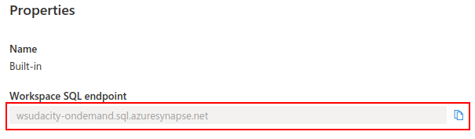

> Change 1: Both Azure Data Factory and Azure Synapse Analytics have linked services, so clarify the title **Step 2: Create Linked Services** to the following:

**Step 2: Create Linked Services in Azure Data Factory**

> Change 2: Replace **1.Create a Linked Service for Azure Data Lake** with the following:

**1.Create a Linked Service for Azure Data Lake Storage**

> Change 3: Replace **Azure Data Lake Gen 2** with

Azure Data Lake Storage Gen 2

> Change 4: Add the following item in the **1.Create a Linked Service for Azure Data Lake** list:

If you get an error that says "This endpoint does not support BlobStorageEvents or SoftDelete... Operation returned an invalid status code 'Conflict'" when testing connection, then you have not enabled hierarchical namespace when creating the Azure Data Lake Storage resource. This option is located in the Advanced tab:

> Change 5: Replace this:
> If you get a connection error, remember to add the IP address to the firewall settings in SQL DB in the Azure Portal
> with this:

If you get a connection error, remember to add the IP address to the firewall settings in SQL DB in the Azure Portal and enable the **Allow Azure services and resources to access this server** option in the DB firewall settings page.

> Change 6: Add the following content under the section **3. Create a Linked Service for Synapse Analytics**:
> (Note: Ideally, we should also update **Azure Data Pipeline Components** > **10. Exercise: Creating Linked Services** but correcting the course is beyond the scope of this project)

#### How to create a Linked Service for Synapse Analytics

- Choose **Azure Synapse Analytics** in the list of Linked services to add.
  

- You need to use the *manual* account selection method.
  

- Get the domain name from your Azure Synapse Analytics page. Navigate to the **SQL pools** menu and click on the **Built-in** pool to view and copy the endpoint.
  

  
