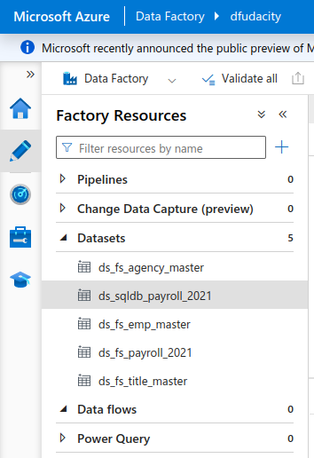

> Change 1: Replace this text **1.Create the datasets for the 2021 Payroll file on Azure Data Lake Gen2** with this:

**1.Create the datasets for the 2021 Payroll file on Azure Data Lake Storage Gen2**

> Change 2: Right before **4. Create the datasets for destination (target) tables in Synapse Analytics**, add the following content:

When completed, your Data Factory Author sidebar should look like the following:

