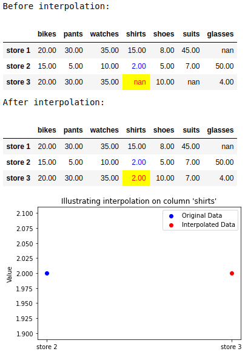
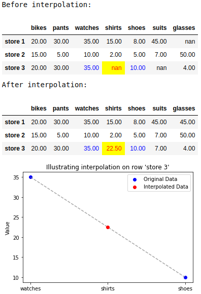

> Add the following content at the bottom of the page.

### Additional notes on (linear) interpolation

When performing interpolation, Pandas takes into account only the *neighboring* values of the `NaN` element.

When the `NaN` value is at the end of a series, Pandas will only take the previous value. That is the reason the `NaN` value in `['store 3', 'shirts']` was replaced by `2.0`. The following screenshot illustrates a calculation performed in **Example 11**:

When there are two neighbors, `interpolate()` finds the middle value between two neighboring values. This screenshot illustrates a calculation performed in **Example 12**:

