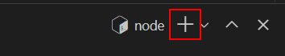

# Workspace for code testing

Feel free to use this workspace to test your client - server code.

If this README document does not show as a nicely-formatted document already, press CTRL + SHIFT + V on your keyboard.

## 1. The Server

The server uses Express JS that you can use as a base for your future API-based projects.

To fire up the server, `cd` to the `server/` directory and run this command:

```bash
node server.js
```

## 2. The client

### 2.1. Setting up the client app
Click on the plus button at the top of the terminal tab to create a new terminal tab:



`cd` to the `client/` directory, and run the following command:

```bash
npm run start
```

And then, click on the **Links** button at the bottom, and then **View the Web Page**. 

### 2.2. Update the `serverURL` variable in the client app
The project simulates the scenario where the client and server apps are two different applications that are hosted on different servers. Since the URLs are dynamically generated by the workspace, you will need to update the server URL setting in the client app every time the workspace is refreshed.

1. After running the server app, click on the **Links** button, and then click the **Server API Page** menu. This will open up a new window. Copy the URL.
2. Open file `client/js/app.js`.
3. Update the `serverURL` value with the URL that you copied in step 1.

