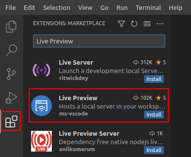
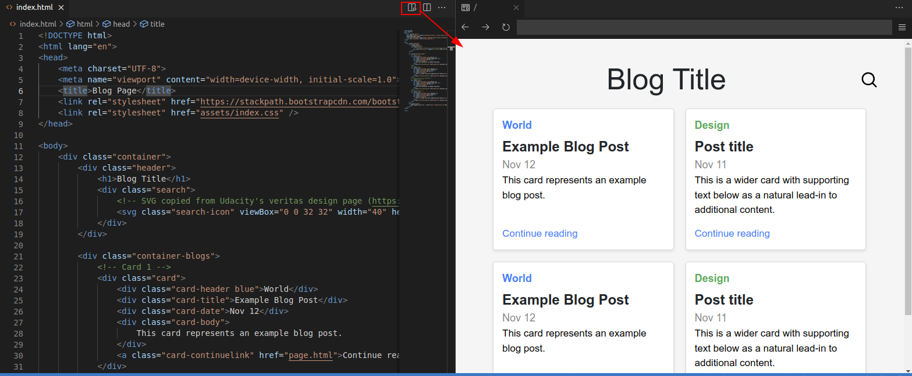

On the next page, you will find a code editor provided by Udacity. You are welcome to create your files locally on your computer or use the workspace to create them. The code editor may look slightly different from the editors you have encountered throughout this course, and this is intentional. The reason is that when you later work on your own projects, you will likely use a similar-looking editor to the one embedded in the project workspace page. Therefore, it would be beneficial for you to become accustomed to it.

We recommend that you open the workspace in another tab. This way, you can work on your code and switch tabs as needed to revisit the instructions.

When you have finished working on this project, download your files, zip them, and submit your project.

### Setting Up HTML Preview in the Workspace

Install the **Live Preview** extension to preview your completed HTML pages as you work on them.

After installation, you should see a new icon at the top-right corner of your file editor tab. Clicking on it will open or refresh the preview tab.

