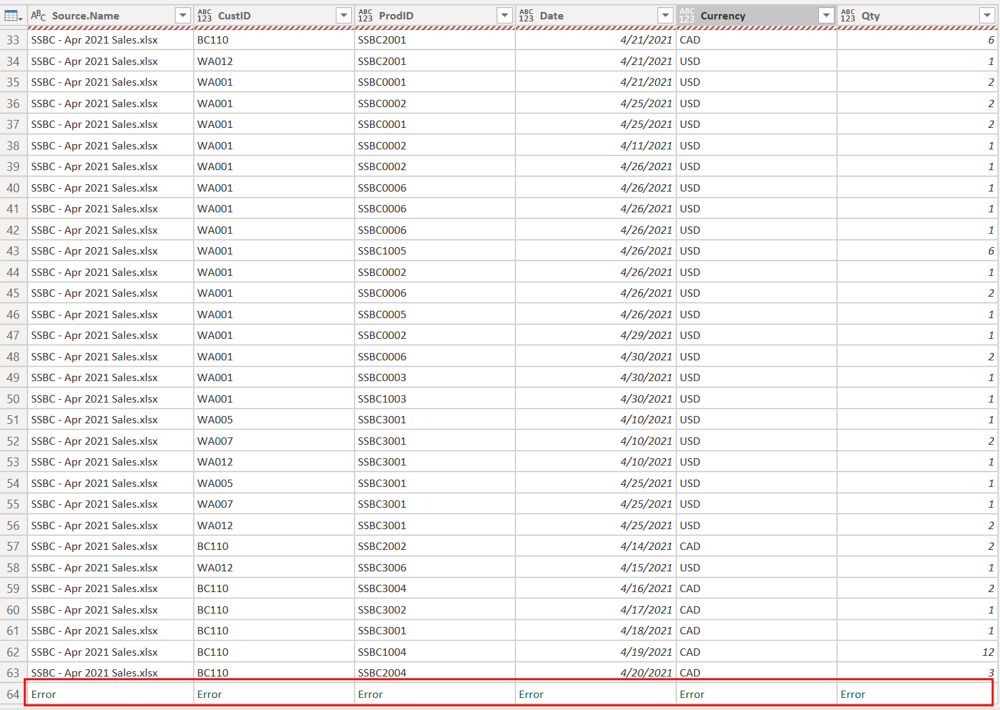
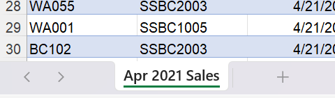
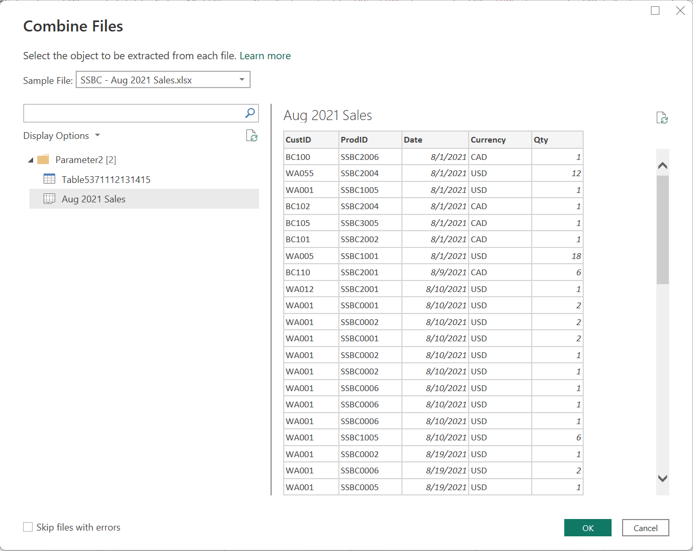
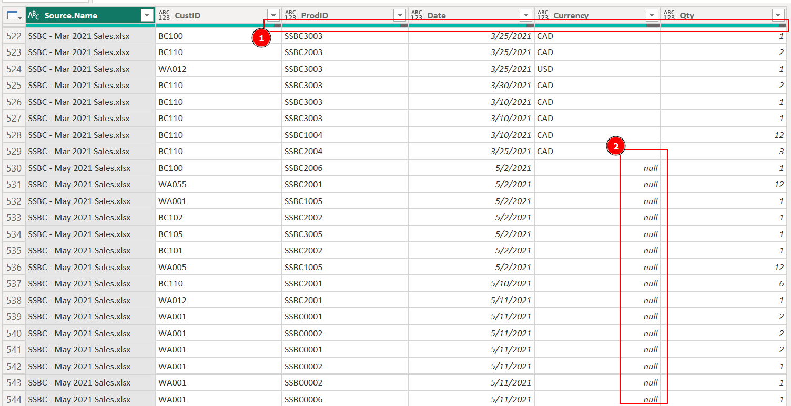

[VIDEO 1]

When loading the **Monthly Sales Logs** directory, you should notice that Power BI is only able to load the data for the first month, followed by an error at the end of the query.

The cause of this behavior is that the name of the main worksheet in each spreadsheet differs from one another. For example, the worksheet name in the `SSBC - Apr 2021 Sales.xlsx` file is `Apr 2021 Sales`.

### Step 1. Instruct Power Query Editor to load the first worksheet of each Excel spreadsheet, irrespective of its name.

In this example, I use the **Aug 2021** spreadsheet since the April spreadsheet has an erroneous extra column `Column6`.

In the "Combine Files" window, I chose the sheet instead of the table; this choice is just a personal preference in this scenario.

- Open the "Transform Sample File" query that was automatically created.
- Click on "Navigation" in the "Applied Steps" query setting.
- Change the function from `Source{[Item="Aug 2021 Sales",Kind="Sheet"]}[Data]` to `Source{0}[Data]`, which means "always get the sheet with index 0".

### Step 2. Correct other errors in the data

Once the data are loaded, you may begin to correct the errors. Notice there are some columns with empty values, and the May 2021 data has empty values in all cells in its "Currency" column.

Hint: It is possible - even recommended - to correct the errors without updating the Excel spreadsheets directly. Try it on your own to hone your Power BI skills. Just as with many things in Power BI, there is no single correct way; feel free to compare your method with the method shown in the tutorial below.

## Tutorial: Addressing the null values purely in Power BI

[VIDEO 2]

1. Open the "Transform Sample File" query.
2. Remove the steps that promotes the first row and corrects data types.
3. Add a new step to remove the first row.
4. Create the column names manually.
5. Update the data types manually.