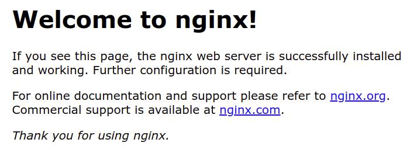

## What About a Web Server?

[VIDEO - CD12352-L18-vid1.mp4](CD12352-L18-vid1.mp4)

If you want the EC2 instances spun up by **AutoScalingGroup** to act as a web server, you will obviously need to set them up as one. You can do this by configuring them to install and set up a web server when they are first instantiated. Remember that in **Servers and Security Groups** > **Launch Templates** we talked about the `LaunchTemplateData.UserData` property. You may enter a setup script into it.

Before that, though, please don't forget to set the `ImageId` property to the latest Ubuntu AMI, else the webserver won't run.

In the project, you will be given a starter code to install and start your NGINX server:

```
#!/bin/bash
apt-get update -y
sudo apt-get install nginx -y
service nginx start
```

When set up properly, you should see the following page when accessing your LoadBalancer's public URL:



### Wait, What is a "LoadBalancer's Public URL"?

Remember from the previous page that the LoadBalancer is the first component to receive a user's request. The request is sent to the LoadBalancer's Domain Name Server (DNS), which also serves as the public URL accessible via a browser.

### Troubleshooting: I got a 502 error instead!

A 502 error indicates that NGINX was not found on the server. There are two most common problems:

1. The most likely cause of this is when we don't use the right AMI for our EC2 instances. Please make sure to pick a UBUNTU AMI that is available in your AWS region.
2. By default, NGINX web server is accessible from port 80, so make sure to open this port for inbound connections. Alternatively, you may also update the NGINX starting code so it runs on port 3000.

If that wasn't the case or you got a different error, you'll need to debug your completed infrastructure, which will be covered in the next few pages.

[CD12352-L18-vid2.mp4 - Running the completed template](CD12352-L18-vid2.mp4)

### Updating Your Website's Index Page

One of the project's rubric requirements is to display a page that contains the following text:

```md
it works! Udagram, Udacity
```

Therefore, you'll need to update your index page from the original NGINX welcome page shown above.

To do this, the `LaunchTemplateData.UserData` property can be updated to include a script that does the following:

1. Create a new `index.html` file.
2. Save this file in the `/var/www/html/` directory. This directory has another file, `index.nginx-debian.html`, which is the default page you saw earlier. The `index.html` page you add will take precedence over this page. 
3. Reload nginx.

Here are some useful bash commands to help you achieve this:

#### To Store Text into a File

```bash
cat <<EOF > [filename]
[content]
EOF
```

Replace `[filename]` with a filename and `[content]` with the content to be saved into that file.

#### To Copy or Move a File

```bash
cp [old location] [new location]
mv [old location] [new location]
```

#### To Act as a Root User

The `/var/www/html/` directory is restricted, so you'll need root access to edit it.

You can add `sudo` to run these commands as a root user, e.g., `sudo cp index.html /var/www/html/index.html`.


#### To Reload nginx

At the end of your script, add the following code to reload nginx to ensure the changes are propagated.

```
sudo systemctl reload nginx
```

[CD12352-L18-vid3-maybe-not-needed.mp4 - Updated the page](CD12352-L18-vid3-maybe-not-needed.mp4)


### Static Assets

A website would be rather bland without any images, CSS, and possibly JavaScript. In the **Storage and Databases** lesson, you learned how to create an S3 bucket and grant your EC2 instances access to it. Revisit the pages from that lesson and add relevant code to your CloudFormation template.

In a real-world web application, server-related code is stored in EC2 instances while assets are stored in S3 buckets.

---

At the end of this step, your CloudFormation template should have the following components:

```yaml
  LaunchTemplate:
    Type: AWS::EC2::LaunchTemplate
    Properties: 
      LaunchTemplateData:
        UserData:
          # Fn::Base64: !Sub |
          Fn::Base64: |
            #!/bin/bash
            apt-get update -y
            sudo apt-get install nginx -y
            service nginx start

            # Script to create index.html
            ...

        ImageId: # Paste the latest UBUNTU AMI
        InstanceType: t2.micro # Replace this with t3.small or better to meet the rubric
        BlockDeviceMappings:
        - DeviceName: "/dev/sdk"
          Ebs:
            VolumeSize: 10

        # The following property is added to give the instances access
        # to read data from your S3 bucket.
        IamInstanceProfile:
          Name: !Ref InstanceRole

  # The S3 bucket
  S3Bucket:
    Type: AWS::S3::Bucket
    ...

  # Role and profile to read data from S3Bucket (and write if needed) 
  InstanceRole:
    Type: AWS::IAM::Role
    # There are some other settings here, check the lesson for details
    ...
    Policies:
    - PolicyName: s3
    PolicyDocument:
    Version: '2012-10-17'
    Statement:
    - Effect: Allow
      Action:
      - 's3:PutObject'
      - 's3:GetObject'
      Resource:
      - !GetAtt S3Bucket.Arn

  InstanceProfile:
    Type: AWS::IAM::InstanceProfile
    Properties:
      Path: '/'
      Roles:
      - !Ref InstanceRole
```

The rest of the template that isn't shown here is similar to the template from **Servers and Security Groups** > **Solution: Load Balancing WebApp Servers**.
