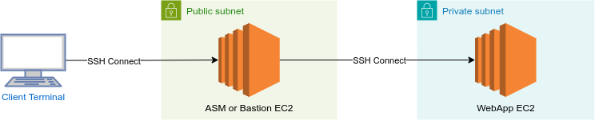

*Note that this step is optional as far as the project rubric is concerned. Nonetheless, it is quite important in a real-world project to be able to debug your infrastructure.*

## How Does the Network Architecture Fit into All This?

Notice that we have glossed over the network infrastructure in all our discussions so far. This is possible due to the *separation of concerns* afforded by the design of CloudFormation. When bringing the network architecture into the picture, note that:

1. **AutoScalingGroup** is configured to spin up EC2 instances in private subnets, as indicated by its `VPCZoneIdentifier` property.
2. **LoadBalancer** is located in both public subnets, as described in its `Subnets` property.

Upon reading the above, you might immediately think that debugging the EC2 instances behind private subnets seems impossible. And you would be correct, unless we make some changes on our infrastructure.

There are many ways to connect to private servers. Here are the three common ones, starting from the easiest to set up:

1. **[Amazon Systems Manager (SSM)](https://docs.aws.amazon.com/systems-manager/latest/userguide/session-manager.html):** This service from AWS allows us to connect to a private server using an IAM access and referencing the EC2 instance ID directly.
2. **[SSH through SSM](https://docs.aws.amazon.com/systems-manager/latest/userguide/session-manager-getting-started-enable-ssh-connections.html):** Using the same service, we may set up a configuration to allow SSH access into your private servers. It has two upsides compared to the above method:
    - The client does not need an AWS user account. A PEM file will suffice.
    - The console you'll be working with is better as it is equipped with various bash features like autocompletion and command history.
3. **SSH through a Bastion Server:** This concept was briefly mentioned in **Servers and Security Groups** > **Exercise: Least Privilege Security Groups**. With this method, we create a bastion server that resides in a public space to connect to the application server that resides in a private repository. Another name for bastion servers is SSH jump boxes for this reason. This method needs more work to set up, but the same infrastructure can be used outside of the AWS infrastructure.

In all of these three methods, what we are doing is basically using another server in a public subnet to connect to a server in a private subnet:

Remember that, in practice, there can be more than one **WebApp EC2**, depending on the number of instances **AutoScaling Group** has created.

In the next couple of lessons, we will explore the first one of these methods; the only one that you can try on the Udacity workspace.