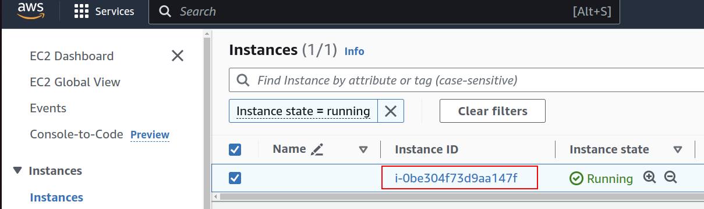

## Installation

[VIDEO - CD12352-L18-SSM_installation.mp4](CD12352-L18-SSM_installation.mp4)

Follow the installation instructions on the [Session Manager User Guide page](https://docs.aws.amazon.com/systems-manager/latest/userguide/install-plugin-debian-and-ubuntu.html).

Run the following commands in your workspace's terminal:

```bash
curl "https://s3.amazonaws.com/session-manager-downloads/plugin/latest/ubuntu_64bit/session-manager-plugin.deb" -o "session-manager-plugin.deb"

sudo dpkg -i session-manager-plugin.deb
```

Then, verify that the installation was successful by running the command:

```bash
aws ssm
```

## CloudFormation Update

You will also need to update your CloudFormation template to allow Amazon SSM access. Update your **InstanceRole** component (the same component that allows access to the S3 bucket) to add a `ManagedPolicyArns` property: 

```

  # Role and profile to read data from S3Bucket (and write if needed) 
  InstanceRole:
    Type: AWS::IAM::Role
    # There are some other settings here, check the lesson for details
    ...
    Policies:
    - PolicyName: s3
    PolicyDocument:
    Version: '2012-10-17'
    Statement:
    - Effect: Allow
      Action:
      - 's3:PutObject'
      - 's3:GetObject'
      Resource:
      - !GetAtt S3Bucket.Arn

      # This is what you need to add
      ManagedPolicyArns:
      - arn:aws:iam::aws:policy/AmazonSSMManagedInstanceCore
```

And update your infrastructure when done.

## Connection

[VIDEO - CD12352-L18-SSM_connection.mp4](CD12352-L18-SSM_connection.mp4)

You will need to configure a profile in your CLI for this action.

Go to your EC2 console and retrieve the ID of the instance you wish to connect to.



Connect to a private server by executing this command:

```bash
aws ssm start-session --target [Instance ID]
```

Like other AWS commands, you may add a `--profile` parameter to it, for example:

```bash
aws ssm start-session --target i-0be304f73d9aa147f --profile udacity
```


## Troubleshooting

### Instance ID is not connected

If you get the following error:

> An error occurred (TargetNotConnected) when calling the StartSession operation: i-0bda9cbbe7fedd14f is not connected.

Then please check the following:
- **InstanceRole** component has `ManagedPolicyArns` property set to `arn:aws:iam::aws:policy/AmazonSSMManagedInstanceCore`.
- **InstanceProfile** component has **Roles** as one of its `Roles` properties.
- **LaunchTemplate** component has `LaunchTemplateData.IamInstanceProfile` property set to the **InstanceProfile** reference.
- When running `aws_configure`, set the default region setting correctly.