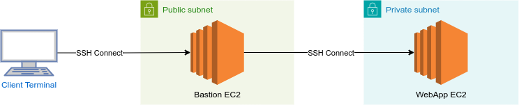

*Note that this step is optional as far as the project rubric is concerned. Nonetheless, it is quite important in a real-world project to be able to debug your infrastructure.*

## How Does the Network Architecture Fit into All This?

Notice that we have glossed over the network infrastructure in all our discussions so far. This is possible due to the *separation of concerns* afforded by the design of CloudFormation. When bringing the network architecture into the picture, note that:

1. **AutoScalingGroup** is configured to spin up EC2 instances in private subnets, as indicated by its `VPCZoneIdentifier` property.
2. **LoadBalancer** is located in both public subnets, as described in its `Subnets` property.

Upon reading the above, you might immediately think that debugging the EC2 instances behind private subnets seems impossible. And you would be correct.

## How Do I Debug an EC2 Instance?

Firstly, you should know that you can use the very terminal in the workspace to gain access to an EC2 instance. This is achieved through Secure Shell (SSH) access, and you can do this by running the following command:

```bash
ssh -i [keypair file] [user]@[server IP or DNS]
```

SSH connections are made via port 22, as mentioned multiple times throughout the lessons. Therefore, you'll need to ensure that port 22 is open (via SecurityGroup settings) to the client's IP (e.g., your computer or a Udacity workspace).

## How to SSH Access a Private EC2 Instance?

To access the EC2 instances behind private subnets, you'll need to create *another* EC2 instance that resides in a public subnet. You will then SSH into this instance, and from there, SSH into the instances in the private subnets. This intermediary instance is known as:

## Bastion Servers

This concept was briefly mentioned in **Servers and Security Groups** > **Exercise: Least Privilege Security Groups**, where you were instructed to create bastions or SSH jump boxes to connect to the application servers. Essentially, the idea is as follows:



Remember that, in practice, there can be more than one **WebApp EC2**, depending on the number of instances **AutoScaling Group** has created.

In the next couple of lessons, we will explore **how to create a key pair**, **how to create a bastion server** and **how to leverage a bastion server to connect to our web server instances.**