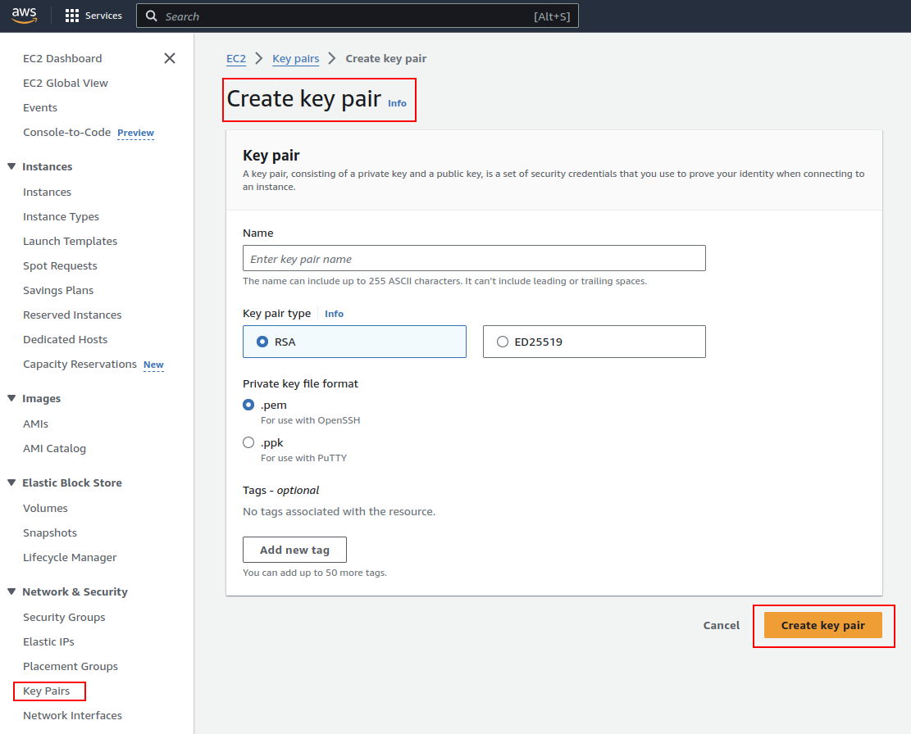

Just as its name suggests, a key pair is essential for unlocking access to a server. Essentially, you need to do the following:

## Step 1. Create a Key Pair

You can create a key pair directly from the AWS console, or, preferably for this project, by running a shell script.

### Create a Key Pair from the Console

This can be done from the EC2 console. Select **Key Pairs** under the **Network & Security** option from the left sidebar.



### Create a Key Pair from the CLI

Alternatively, you may want to create a script to run before setting up your infrastructure in CloudFormation.

```bash
aws ec2 create-key-pair --key-name "MyKeyPair" --query 'KeyMaterial' --output text > "MyKeyPair.pem"
chmod 400 MyKeyPair.pem
```

The command above creates a key pair on AWS named `MyKeyPair` and exports the `KeyMaterial` part (i.e., the actual PEM key) into a file named `MyKeyPair.pem`.

Change `MyKeyPair` to a name that will help you identify your key pair. You will use this name to reference this key pair in your CloudFormation template.

The `chmod` command is needed for the key pair file to limit the access to it or else you are going to get an error `Permissions 0644 for './MyKeyPair.pem' are too open.` when using it in your `ssh` command.

## Step 2. Download the PEM File Produced by the Key Pair Creation

When creating from the console, you will need to manually download the PEM file. When creating from the CLI, the PEM file is automatically downloaded and saved to `MyKeyPair.pem` if you use the command above.

Keep this file safe as you will need it to SSH connect to your servers.

**Trivia**: A PEM key, which stands for Privacy Enhanced Mail, is a type of digital certificate file format used in various cryptographic applications. Although the name originates from a now-defunct email encryption system, the PEM format has become widely used for more general purposes. It's commonly employed for representing both private keys and certificates (which can include public keys) in a text-based, human-readable format.

## Step 3. Assign the Key Pair to Your EC2 Instances

In your CloudFormation template, you can do this by setting the `LaunchTemplateData.KeyName` property of your `AWS::EC2::LaunchTemplate` component.

---

So far, your **LaunchTemplate** code may look something like this:

```yaml
  WebAppLaunchTemplate:
    Type: AWS::EC2::LaunchTemplate
    Properties: 
      LaunchTemplateData:
        UserData:
          Fn::Base64: |
            #!/bin/bash
            apt-get update -y
            sudo apt-get install nginx -y
            service nginx start

            # Script to create index.html
            ...

        ImageId: # Paste the latest UBUNTU AMI
        InstanceType: t2.micro # Change this to t3.small or better to meet the rubric.
        BlockDeviceMappings:
        - DeviceName: "/dev/sdk"
          Ebs:
            VolumeSize: 10

        # This is the only line that we need to add for now
        KeyName: MyKeyPair
```

As instructed in this template, AutoScalingGroup is going to attach the key pair `MyKeyPair` to all new instances it creates.

Keep in mind that we can't ssh connect to these instances just yet since they reside behind private subnets.