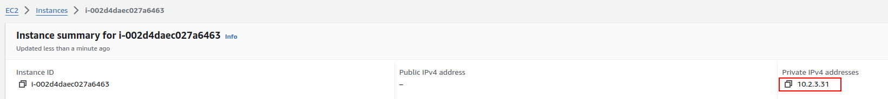

Now that you've got everything set up, let's try to SSH connect to your server!

> Unfortunately, due to some workspace restrictions, you cannot perform this from the Udacity workspace. The commands on this page should be run from your local computer, where you have access to execute `ssh-add`.

## Step 1. Identify the EC2 Instances

Go to the AWS EC2 console and select instances. You should see two instances there: one for the bastion host and another for the EC2 instance created by the AutoScaling group:


Remember how we added a `Name` tag to the bastion host called `Bastion Host` in the previous page? This tag is useful here.

Click on the Bastion Host's EC2 Instance link and take note of its *public IP address*.


We will refer to it as the **Bastion IP**.

Then, click on the web application's EC2 Instance link and take note of its *private IP address*.



We will refer to it as the **WebApp IP**.

## Step 2. SSH Connect from Local Computer with Agent Forwarding

Now, we will use a variation of `ssh -i` to forward the PEM file from the Bastion server to the WebApp server. Run the following commands on your local terminal:

```bash
ssh-add ./MyKeyPair.pem
ssh -A -i ./MyKeyPair.pem ubuntu@[Bastion IP]
```

Note the added parameter `-A`, which activates the agent forwarding feature.

You should see messages indicating a successful connection, followed by a change in your terminal environment:


## Step 3. SSH Connect from Bastion Server to WebApp Server

Next, perform an SSH connection from the Bastion server to the WebApp server. This time, you can just run the `ssh` command without referencing the PEM file, thanks to the Agent Forwarding feature:

```bash
ssh ubuntu@[WebApp IP]
```

Again, you should see some messages followed by another change in the terminal environment:


From here, you may freely debug your EC2 instance. For instance, you can check if Nginx is running with the command `systemctl status nginx`, or verify the `index.html` page creation with the `cat` command.

