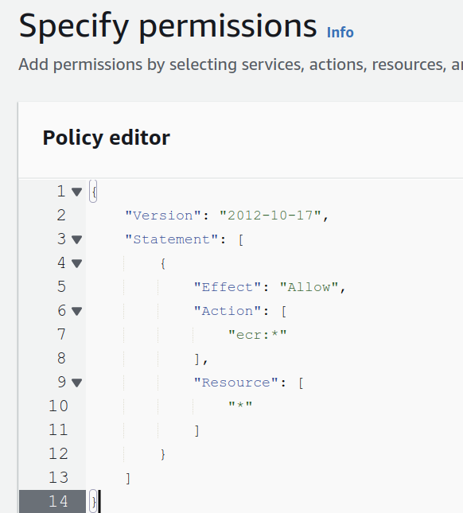
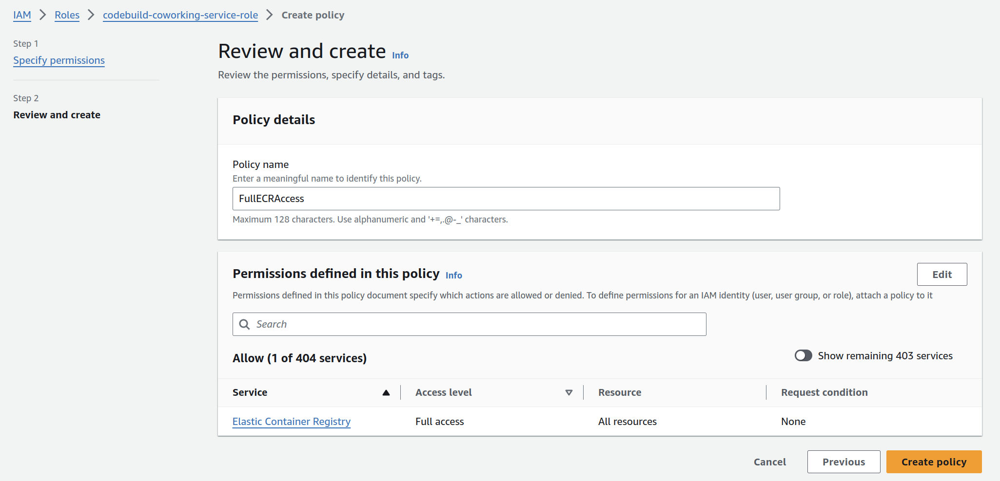

For this demo, we're going to go through the process for how we can take code that we have in GitHub, connect it to use CodeBuild to build this code into a Docker image, and then use CodeBuild to push the same Docker image into ECR.

To start off, this is the build spec YAML file that tells CodeBuild how to process and what to do in a specific build job:

```
version: 0.2

phases:
  pre_build:
    commands:
      - echo Logging into ECR
      - aws ecr get-login-password --region $AWS_DEFAULT_REGION | docker login --username AWS --password-stdin $AWS_ACCOUNT_ID.dkr.ecr.$AWS_DEFAULT_REGION.amazonaws.com
  build:
    commands:
      - echo Starting build at `date`
      - echo Building the Docker image...          
      - docker build -t $IMAGE_REPO_NAME:$IMAGE_TAG .
      - docker tag $IMAGE_REPO_NAME:$IMAGE_TAG $AWS_ACCOUNT_ID.dkr.ecr.$AWS_DEFAULT_REGION.amazonaws.com/$IMAGE_REPO_NAME:$IMAGE_TAG      
  post_build:
    commands:
      - echo Completed build at `date`
      - echo Pushing the Docker image...
      - docker push $AWS_ACCOUNT_ID.dkr.ecr.$AWS_DEFAULT_REGION.amazonaws.com/$IMAGE_REPO_NAME:$IMAGE_TAG
```

We have the pre-build, build, and post-build phases here. Essentially what it does is:

1. sets up a connection to ECR. 
2. builds and tags the Docker image that is created.
3. And then it takes this Docker image and pushes it into ECR.


One thing to note is that this file is relatively generic, meaning that it has a lot of placeholder variables that need to be populated inside of the CodeBuid job. For example, the AWS account ID is set as a variable and not hard-coded inside. These will need to be addressed inside of the actual CodeBuid project itself.


The GitHub repository needs the following:

- The app folder, which contains all of the project files
- The Docker file that contains the instructions for how to build the app into a Docker image
- and the buildspec file (shown above).

Note that the buildspec file is put inside of the root of this repository. That way, when CodeBuild is processing a build for this repository, it knows where to look for it.

### How to create a new CodeBuild project

Create a project using the Create Build Project button and go through the guided process for creating a new CodeBuild project.

Inside Source, we need to **specify where our code is going to be located** so that CodeBuild knows how to connect and what to run it with.

Our code is hosted in GitHub, so we're going to set the source provider as GitHub. 

If this is your first time using CodeBuild, you'll need to set up access between CodeBuild and GitHub. To do so, there are two symbol options, you can either connect using OAuth or you can use a personal access token. Either of these options are fine, but connecting using OAuth is a bit more streamlined and simple, so we'll be using that option for this demo.

### Now we're going to specify the environment.

How CodeBuild works: When a build job starts, it allocates containers that run your build job.

We need to specify what type of image we want to use. For this demo, we'll be using the Amazon Linux 2 image.

The runtime operating system image, this might differ based off of your own project requirements or your business use cases.

### Environment Variables and IAM Role Modifications

Environment variables are set during project creation to replace placeholders in the build spec file. The IAM role created for CodeBuild needs adjustments to grant permissions for ECR access.


## Important: Add permissions to update ECR to the newly created role

Go to the IAM console > Roles, then find the role you have created when creating the CodeBuild project.

Under the *Permissions* tab, click on **Add Permissions** then choose **Create inline policy**. Choose **JSON**, then replace the policy with the following:

```json
{
	"Version": "2012-10-17",
	"Statement": [
		{
			"Effect": "Allow",
			"Action": [
			    "ecr:*"
			],
			"Resource": [
			    "*"
			]
		}
	]
}
```



Give an appropriate name to this policy e.g. **FullECRAccess** and then click on **Create Policy**.



## Build Execution and Results

Go back to the CodeBuild project you have created, then click on **Start Build**.

Starting the build transforms code into a Docker image, which is then pushed to ECR. The process concludes with verifying the Docker image in the ECR repository, tagged with the version specified in the environment variables.

When the build is completed, you should see a build status "Succeeded" at the top of the project page.

