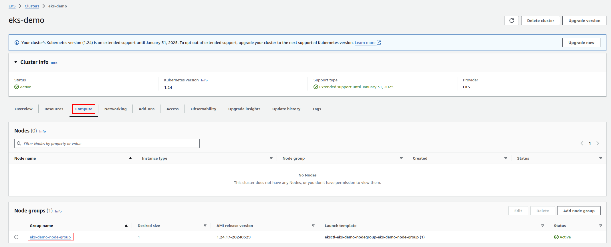
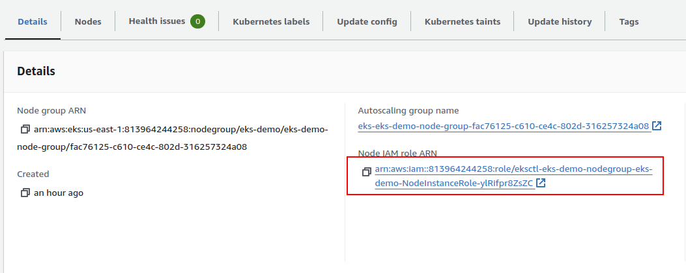
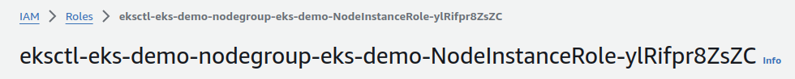

Container Insights can be installed to your CloudWatch to give you periodic application logging that will be useful to periodically check your application's health.

To do this, you may follow the following tutorial from AWS to install Amazon CloudWatch Observability EKS add-on:

[Install the CloudWatch agent by using the Amazon CloudWatch Observability EKS add-on](https://docs.aws.amazon.com/AmazonCloudWatch/latest/monitoring/install-CloudWatch-Observability-EKS-addon.html)

All you need to do is run a couple of short commands on your terminal:

**Step 1.** Attach the **CloudWatchAgentServerPolicy** IAM policy to your worker nodes:

```bash
aws iam attach-role-policy \
--role-name my-worker-node-role \
--policy-arn arn:aws:iam::aws:policy/CloudWatchAgentServerPolicy 
```

Replace `my-worker-node-role` with your EKS cluster's Node Group's IAM role.

To find out the name of the IAM role, open up the **Compute** tab of your EKS cluster, click on the Node Group.



And from there, click on the IAM role ARN under the **Details** tab.



The IAM role name should be there on the heading of the page that comes up.



**Step 2.** Use AWS CLI to install the Amazon CloudWatch Observability EKS add-on:

```bash
aws eks create-addon --addon-name amazon-cloudwatch-observability --cluster-name my-cluster-name
```

Replace `my-cluster-name` with your EKS cluster's name.

**Step 3.** Trigger logging by accessing your application.

**Step 4.** Open up CloudWatch **Log groups** page. You should see `aws/containerinsights/my-cluster-name/application` there.

[The updated log groups](logs1.png)

Click on one of the log streams to see the logs.

[The logs that show the health of the application](logs2.png)