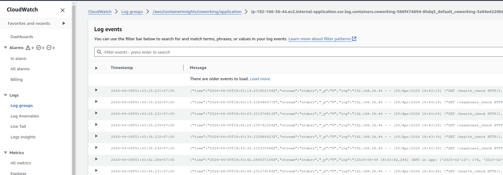

As requested by one of the rubric specifications, you need to set up CloudWatch logging. In particular, we are going to use its **Container Insights** feature.

Read relevant resources under the **Operationalizing Kubernetes** lesson to learn more about CloudWatch Container Insights and how to set it up.

We expect to see something like the following in one of your screenshots:

