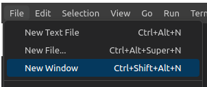

## Fork and Clone Project Repoository

Start by <a href="https://github.com/udacity/cd12355-microservices-aws-kubernetes-project-starter" target="_blank">forking and cloning the starter repository for the project</a>. Specifically, you need to:

- Fork the starter project to your account.
- Clone your repository to your workspace.

You will need to update this repository to test your CodeBuild spec and to later be submitted. To avoid *permission denied (publickey)* error, you need to [generate and add an SSH key to connect the workspace to your GitHub account](https://docs.github.com/en/authentication/connecting-to-github-with-ssh/generating-a-new-ssh-key-and-adding-it-to-the-ssh-agent?platform=linux) (follow the tutorial for the Linux platform since that's what the workspace uses).

> **Note**: If you can't paste content into the workspace, you may workaround this by opening up a new window and then generate SSH from that new window. Close the window and keep working on the original workspace window when you're done.  



Before pushing your updates to your repository, you'll need to identify yourself by running the following commands:

```bash
git config --global user.email "you@example.com"
git config --global user.name "Your Name"
```

Since the workspace is reset each time the session ends, you will need to redo the ssh update steps, and you can also delete the previously stored SSH key in your GitHub account. Don't worry, it gets easier the more times you do it!

### Project Dependencies

You'll need a workspace for this project.  You can use the workspace in the classroom on the following pages, or you can complete the project using your local computer. 

### Workspace Environment Requirements

You'll need these tools to compete this project.  If you are using the Udacity workspace on the following pages, all of these tools are installed and provided in the workspace.  

If you're using your own local computer, you'll need:  

* <a href="https://git-scm.com/downloads" target="_blank">**Git**</a>: You will use Git to copy the starter code to your local.
* Python Environment - run Python 3.8+ applications and install Python dependencies via pip
* Docker CLI - build and run Docker images locally
* **Kubectl**: Install <a href="https://kubernetes.io/docs/tasks/tools/" target="_blank">kubectl</a> and verify as:
```bash
kubectl version --short
```


If no clusters are running on your local machine, the output will read *"The connection to the server localhost:8080 was refused."* However, when there is a cluster running, the expected output will be:

```
Client Version: v1.26.3
Server Version: v1.25.3
```

**Caveat:** The version difference between client (1.26) and server (1.25) should **NOT** exceed the minor version skew of +/-1. Otherwise, consider upgrading the `kubectl` to a specific version. The instructions to upgrade are also available in the <a href="https://kubernetes.io/docs/tasks/tools/" target="_blank">kubectl</a> docs. 

### Remote Resource Requirements

This project utilizes Amazon Web Services (AWS). You'll find instructions for using a temporary AWS account on the next page.  The AWS resources you'll need to use for the project include: 

* AWS CLI
**Installation Instructions**: Refer to the official <a href="https://docs.aws.amazon.com/cli/latest/userguide/install-cliv2.html" target="_blank">AWS instructions to install/update AWS CLI</a> (version 2) based on your underlying OS. You can verify the installation using the following command in your terminal (macOS)/cmd (Windows). 

```bash
# Display the folder that contains the symlink to the aws cli tool
which aws
# See the current version
aws --version
```

Afterward, run `aws configure` to set up your AWS settings. We recommend creating a new IAM user with an *AdministratorAccess* policy rather than using the federated user credentials directly. This approach avoids the need for reconfiguration after session timeouts.

* AWS CodeBuild - build Docker images remotely
* AWS ECR - host Docker images
* Kubernetes Environment with AWS EKS - run applications in k8s
* AWS CloudWatch - monitor activity and logs in EKS