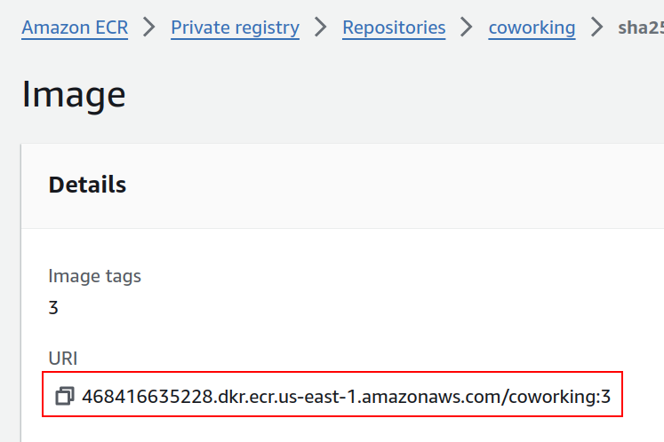

Once you have set up the database, you may proceed to build the analytics application.

First, let's try running the application locally, without Docker.

In the analytics/ directory:

### 1. Install Dependencies

```bash
pip install -r requirements.txt
```

### 2. Run the Application

The code in `app.py` requires some environment variables to be set.

There are multiple ways to set environment variables in a command line session. They can be set for the session by running `export KEY=VALUE` in the command line, or they can be prepended directly to your command.

If we set the environment variables by exporting them, it would look like the following:

```bash
export DB_USERNAME=postgres
export DB_PASSWORD=${POSTGRES_PASSWORD}
export DB_HOST=127.0.0.1
export DB_PORT=5433
export DB_NAME=postgres
python app.py
```

**Important:** Before running the code above, don't forget to set up port forwarding for the database service and the `POSTGRES_PASSWORD` environment variable as mentioned on the previous page. To be more specific, these are the commands:

```bash
# To set up port forwarding
kubectl port-forward --namespace default svc/<SERVICE_NAME>-postgresql 5433:5432 &

# To export the password
export POSTGRES_PASSWORD=$(kubectl get secret --namespace default <SERVICE_NAME>-postgresql -o jsonpath="{.data.postgres-password}" | base64 -d)
```

**Note:** When working with Kubernetes, you will set these environment variables via the deployment YAML file.

### 3. Verify the Application

You may run these commands in another terminal window:

- Generate a report for check-ins grouped by dates

  ```bash
  curl <BASE_URL>/api/reports/daily_usage
  ```
- Generate a report for check-ins grouped by users

  ```bash
  curl <BASE_URL>/api/reports/user_visits
  ```

In this case, since the code is run directly on the local computer rather than through Docker, the BASE_URL is `127.0.0.1:5153`. The port `5153` is specified in the `app.py` script.

### 4. Dockerize the Application

Once you have verified that the application code can be run successfully, you may now Dockerize this application.

1. Write a Dockerfile for the coworking analytics application. From now on, I'll use the name `coworking` as a placeholder for this application.
2. Test your Docker image by building and running it:

   ```bash
   # To build
   docker build -t test-coworking-analytics .

   # To run on a specific port
   docker run -p <local_port>:<container_port> test-coworking-analytics
   ```

   Replace `<local_port>` with the port you want to use to access the Docker image externally, and `<container_port>` with the port exposed by the Docker image.

**Note:** It is easier to verify the correctness of the Dockerized application after you have deployed it in the same Kubernetes cluster as the PostgreSQL database service, so you can leave this part for later once you have a basic Dockerfile written.

### 5. Set up Continuous Integration with CodeBuild

The purpose of this step is to provide a systematic approach to pushing the Docker image of the `coworking` application into AWS ECR.

Create a `buildspec.yaml` file that will be triggered whenever the project repository is updated. This script needs to:

- Set up Docker login with `aws ecr get-login-password`
- Build the coworking analytics application using `docker build`
- Tag the image with the `docker tag` command, automating this process by using the `$CODEBUILD_BUILD_NUMBER` variable
- Push the image to your Amazon ECR account with `docker push`

Feel free to revisit the relevant course content from the "Microservices for DevOps on AWS" lesson.

### 6. Deploy the Application

Create a deployment YAML file to deploy the finalized Docker image in your ECR repository to your Kubernetes network. You may use the following file as a starting point:

```yaml
apiVersion: v1
kind: Service
metadata:
  name: coworking
spec:
  type: LoadBalancer
  selector:
    service: coworking
  ports:
  - name: "5153"
    protocol: TCP
    port: 5153
    targetPort: 5153
---
apiVersion: apps/v1
kind: Deployment
metadata:
  name: coworking
  labels:
    name: coworking
spec:
  replicas: 1
  selector:
    matchLabels:
      service: coworking
  template:
    metadata:
      labels:
        service: coworking
    spec:
      containers:
      - name: coworking


        image: <DOCKER_IMAGE_URI_FROM_ECR>
        imagePullPolicy: IfNotPresent
        livenessProbe:
          httpGet:
            path: /health_check
            port: 5153
          initialDelaySeconds: 5
          timeoutSeconds: 2
        readinessProbe:
          httpGet:
            path: "/readiness_check"
            port: 5153
          initialDelaySeconds: 5
          timeoutSeconds: 5
        env:
        - name: DB_HOST
          value: <SERVICE_NAME>-postgresql
        - name: DB_PORT
          value: "5432"
        - name: DB_USERNAME
          value: postgres
        - name: DB_PASSWORD
          valueFrom:
            secretKeyRef:
              name: <SERVICE_NAME>-postgresql
              key: postgres-password
        - name: DB_NAME
          value: postgres
      restartPolicy: Always
```

Replace `<DOCKER_IMAGE_URI_FROM_ECR>` with the Docker image URI from Amazon ECR.



At the bottom, the following section sets the environment variables in your Docker container:

```yaml
   env:
   - name: DB_HOST
     value: <SERVICE_NAME>-postgresql
   - name: DB_PORT
     value: "5432"
   - name: DB_USERNAME
     value: postgres
   - name: DB_PASSWORD
     valueFrom:
       secretKeyRef:
         name: <SERVICE_NAME>-postgresql
         key: postgres-password
   - name: DB_NAME
     value: postgres
```

Here are a couple of things you need to know about this part:

- `DB_HOST` is the name of the service that you get from running `kubectl get svc`.
  
  
  
- The setting for `DB_PASSWORD` is essentially accessing the same value as the command above: `$(kubectl get secret --namespace default <SERVICE_NAME>-postgresql -o jsonpath="{.data.postgres-password}" | base64 -d)`.

### 7. Verify the Deployment

As a final verification, you may execute the same CURL commands above but change the `BASE_URL` to the External-IP obtained from this command's output:

```bash
kubectl get svc coworking
```

### (Optional) Verification with minikube

If you're doing this locally through minikube, you need to instead run the following command:

```bash
minikube service coworking
```

This command sets up the port and gives you the address from which you can access your application. Here's an example of its output:


