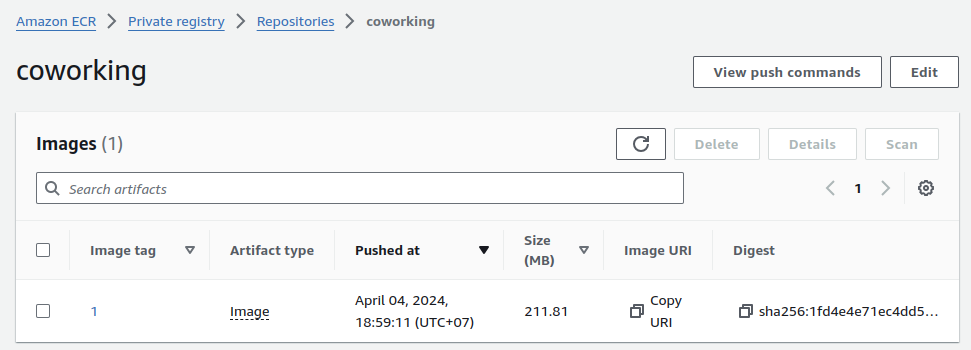
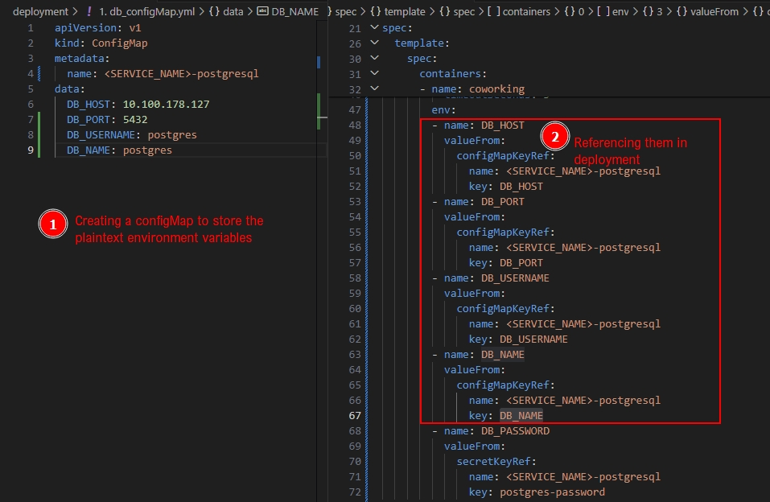
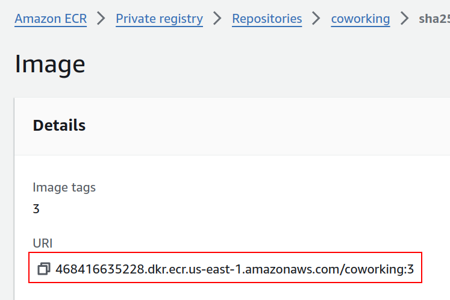
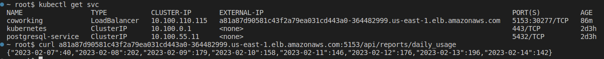

Once you have verified that the application code runs successfully, you may now begin the deployment process. The deployment process is divided into three steps:

1. Dockerize the application
2. Set up Continuous Integration with CodeBuild
3. Deploy the application on Kubernetes

You may follow the step-by-step instructions on this page to help you complete this part of the project.

### 1. Dockerize the Application

#### 1.1. Update Docker Version
Before setting up our Docker container, run the following commands on the workspace to update to the latest Docker version:

```bash
apt update
apt install docker-ce docker-ce-cli containerd.io
```

#### 1.2. Build and Run a Docker Image

Now, you just need to write the Dockerfile for the coworking analytics application (I'll use *coworking* as a placeholder name of this application).

1. This file can be placed in the `analytics/` directory, as an example.
2. Unsure what to write in your Dockerfile? Take a look at the previous page again:
   - The instructions to create the application locally can be moved over to your Dockerfile.
   - For its `FROM` instruction, you may use an appropriate Docker image with a Python version that is identical to your local environment's Python version. Search for it on [DockerHub](https://hub.docker.com/_/python). I generally prefer the `slim` version of the image.
   - Add a parameter `-y` to your `apt` commands to automatically answer `yes` to all questions. For example, `apt update -y`.
3. Test your Docker image by building and running it.

To build the Docker image, run the following command:

```bash
docker build -t test-coworking-analytics .
```

#### 1.3. Verify the Docker Image

You may then run the Docker image to test it. Since the image does not have a visibility to ports in your localhost, the fastest way to verify your work is by setting Docker to use the host's network:

```bash
docker run --network="host" test-coworking-analytics
```

Docker will use the same network as the host. That means it is accessible through the same port as the port opened by `app.py`, which is `5153`. Note that this also means that:

1. You need to close the local application before running this Docker container.
2. You can only have a single copy of this Docker container.

You may use the `curl` commands mentioned in the **Build the Analytics Application Locally** page to test your Dockerized app. When correct, you should get the same output as then.

> **Note**: To enable Docker to run on specific ports and yet able to connect to localhost ports, the process is quite involved and is beyond the scope of this project. Generally speaking, you'll need to change the DB_HOST setting to the host's IP found by using `ip addr show docker0` and use [socat](https://www.redhat.com/sysadmin/getting-started-socat) to enable a publicly available port to access the database port. The DB_PORT setting should then be updated to this public port.

### 2. Set up Continuous Integration with CodeBuild

#### 2.1. Setting Up
The purpose of this step is to provide a systematic approach to pushing the Docker image of the `coworking` application into Amazon ECR.

First, create an Amazon ECR repository on your AWS console.

Then, create an Amazon CodeBuild project that is connected to your project's GitHub repository.

Once they are done, create a `buildspec.yaml` file that will be triggered whenever the project repository is updated. This script needs to do the following:

* pre-build: Set up Docker login with `aws ecr get-login-password`
* build:
   * Build the coworking analytics application using `docker build`
   * Tag the image with the `docker tag` command. Automate this process by using the `$CODEBUILD_BUILD_NUMBER` variable (rather than entering the image tags manually)
* post-build: Push the image to your Amazon ECR account with `docker push`

The relevant course content for this task is available in the "Microservices for DevOps on AWS" lesson.

Don't forget to:

* Add appropriate environment variables through your AWS console
* Update the permission of the IAM role created by CodeBuild to gain access to the ECR repository

#### 2.2. Verify

Click on the "Start Build" button on your CodeBuild console and then check out Amazon ECR to see if the Docker image is created/updated.



### 3. Deploy the Application

#### 3.1. ConfigMap

Begin by creating a ConfigMap; It will store all the plaintext variables such as DB_HOST, DB_USERNAME, DB_PORT, DB_NAME. 

* DB_HOST is the name of the service that you get from running `kubectl get svc`.


* DB_USERNAME and DB_NAME are the values you set up earlier while configuring the Database service. 
* DB_PORT should be set to `5432` instead of `5433` since we are not working with a forwarded port this time.

You can refer to the Kubernetes documentation on how to create <a href="https://kubernetes.io/docs/concepts/configuration/configmap/#configmaps-and-pods" target="_blank">configMap</a>.

> Note: It is essential to create a configMap to store the plaintext environment variables and reference them in the Deployment file. The screenshot below highlights such an example.  



#### 3.2. Secret

Secret will store all the sensitive environment variables such as (DB_PASSWORD). You can refer to the Kubernetes documentation on how to create <a href="https://kubernetes.io/docs/tasks/configmap-secret/managing-secret-using-config-file/" target="_blank">Secret</a>. 

Once you finish creating ConfigMap and Secret are created, you can reference them in the Deployment manifest file using either `env` or `envFrom` as given in the example YAML file in the Deployment section. To know more about the difference and usage of the two, you can read these documentations:

* <a href="https://kubernetes.io/docs/tasks/inject-data-application/define-environment-variable-container/#define-an-environment-variable-for-a-container" target="_blank">Define Environment Variables</a>
* <a href="https://kubernetes.io/docs/tasks/configure-pod-container/configure-pod-configmap/#configure-all-key-value-pairs-in-a-configmap-as-container-environment-variables" target="_blank">env vs envFrom along with ConfigMap</a>
* <a href="https://kubernetes.io/docs/tasks/inject-data-application/distribute-credentials-secure/#define-container-environment-variables-using-secret-data" target="_blank">env vs envFrom along with Secret</a>

#### 3.3. Deployment

Create a deployment YAML file to deploy the finalized Docker image in your ECR repository to your Kubernetes network. You may use the following file as a **starting point**. Feel free to adjust the file below to suit your requirements. 

```yaml
apiVersion: v1
kind: Service
metadata:
  name: coworking
spec:
  type: LoadBalancer
  selector:
    service: coworking
  ports:
  - name: "5153"
    protocol: TCP
    port: 5153
    targetPort: 5153
---
apiVersion: apps/v1
kind: Deployment
metadata:
  name: coworking
  labels:
    name: coworking
spec:
  replicas: 1
  selector:
    matchLabels:
      service: coworking
  template:
    metadata:
      labels:
        service: coworking
    spec:
      containers:
      - name: coworking
        image: <DOCKER_IMAGE_URI_FROM_ECR>
        imagePullPolicy: IfNotPresent
        livenessProbe:
          httpGet:
            path: /health_check
            port: 5153
          initialDelaySeconds: 5
          timeoutSeconds: 2
        readinessProbe:
          httpGet:
            path: "/readiness_check"
            port: 5153
          initialDelaySeconds: 5
          timeoutSeconds: 5
        envFrom:
        - configMapRef:
            name: <NAME OF THE CONFIG MAP>
        env:
        - name: DB_PASSWORD
          valueFrom:
            secretKeyRef:
              name: <NAME OF THE Secret>
              key: <THE KEY FROM Secret WHICH has THE ENCODED PASSWORD>
      restartPolicy: Always
```

The YAML code block below highlights the section you must update in your final Deployment file. Update the environment variables per your requirements. We have mentioned only one variable as an example. 

```yaml
        envFrom:
        - configMapRef:
            name: <NAME OF THE CONFIG MAP>
        env:
        - name: DB_PASSWORD
          valueFrom:
            secretKeyRef:
              name: <NAME OF THE Secret>
              key: <THE KEY FROM Secret WHICH has THE ENCODED PASSWORD>
```

Also, replace the `<DOCKER_IMAGE_URI_FROM_ECR>` with the Docker image URI from Amazon ECR.



FYI: The setting for `DB_PASSWORD` is essentially accessing the same value as the command below:

```bash
kubectl get secret <NAME OF THE Secret> -o jsonpath="{.data.<THE KEY FROM Secret WHICH has THE ENCODED PASSWORD>}" | base64 -d
```

### 4. Verify the Deployment

As a final verification, you may execute the same CURL commands above but change the `BASE_URL` to the External-IP obtained from this command's output:

```bash
kubectl get svc
```


