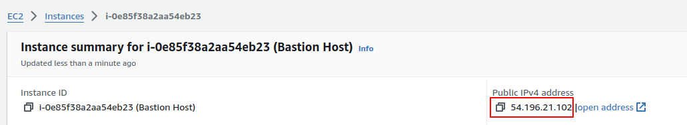
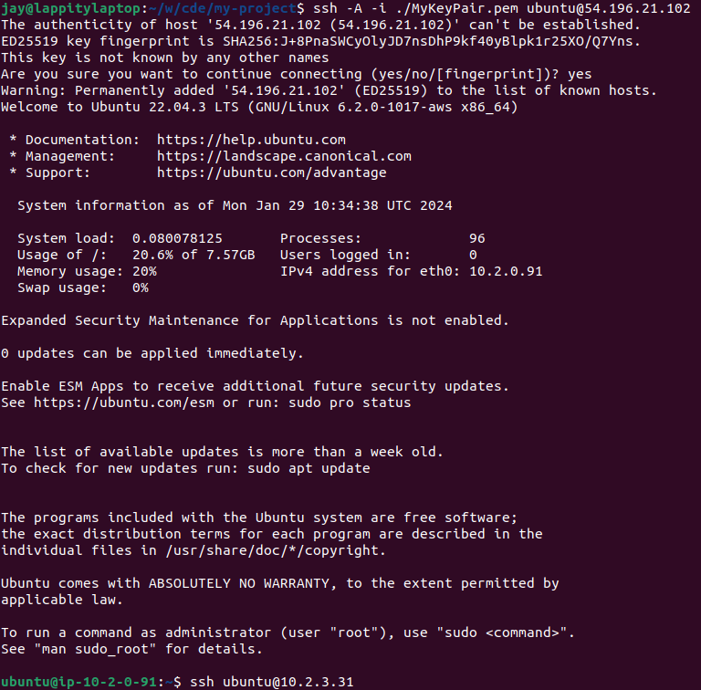
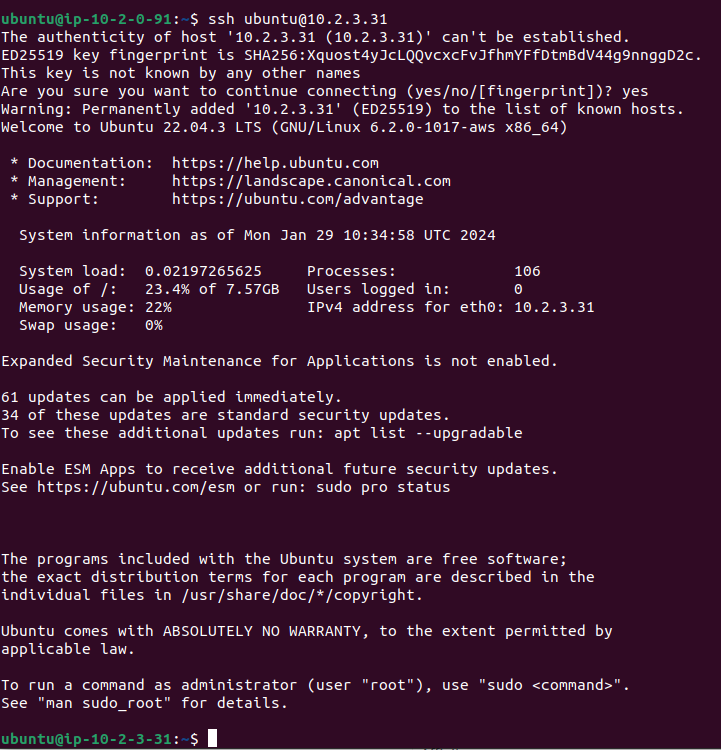
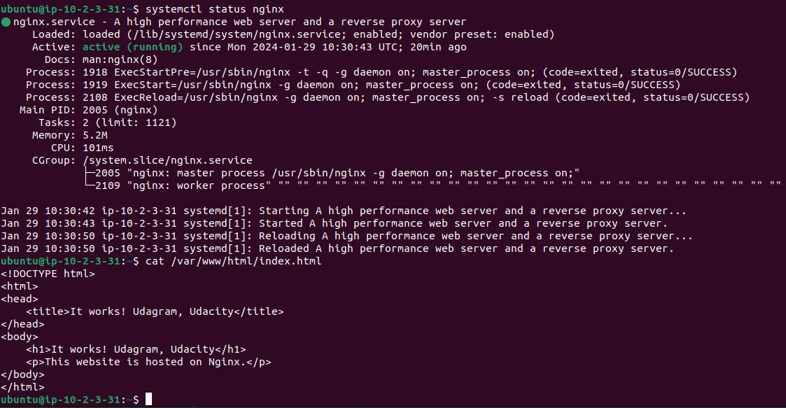

To create a bastion server, here are some additions needed to your CloudFormation template:

1. An EC2 Instance as the bastion server
2. A SecurityGroup for the bastion server to allow port 22 access from external IP addresses.
3. Update the SecurityGroup of the existing web server (**not** the Load Balancer Security Group) to allow port 22 access from the bastion server's security group.

Additional notes:
- The bastion server must be placed in a public subnet.
- The bastion server's EC2 component must also have a `KeyName` property.

---

```yaml
  # EC 2 server as a bastion host
  Bastion:
    Type: AWS::EC2::Instance
    Properties:
      InstanceType: t2.micro
      KeyName: MyKeyPair
      ImageId: # Paste the latest UBUNTU AMI

      SecurityGroupIds:
        - !Ref BastionSecurityGroup

      # Use either any public subnet
      SubnetId:
        Fn::ImportValue: !Sub "${ExerciseName}-public-subnet1"

      # this helps us identify which EC2 instance is the Bastion Host
      Tags:
        - Key: Name
          Value: "Bastion Host"

  # The Security Group of the Bastion Host
  BastionSecurityGroup:
    Type: AWS::EC2::SecurityGroup
    Properties:
      GroupDescription: Allow public SSH access to the bastion host
      VpcId:
        Fn::ImportValue:
          !Sub "${ExerciseName}-vpc-id"
      SecurityGroupIngress:
      # Allow SSH access to the bastion host
      # Ideally, set the ip address of your local computer. In this case, though,
      # let's just allow any ip address.
      - IpProtocol: tcp
        FromPort: 22
        ToPort: 22
        CidrIp: 0.0.0.0/0

  # The Security Group of the WebApp (named `SecurityGroup` in the template)
  # Add an additional port to its ingress rule so the bastion host may connect into it.
  WebAppSecurityGroup:
    Type: AWS::EC2::SecurityGroup
    Properties:
      ...
      SecurityGroupIngress:
      ...
      # Add the following item to allow SSH access from the bastion host
      - IpProtocol: tcp
        FromPort: 22
        ToPort: 22
        SourceSecurityGroupId: !Ref BastionSecurityGroup
```

## Connection

Now that you've got everything set up, let's try to SSH connect to your server!

> Unfortunately, due to some workspace restrictions, you cannot perform this from the Udacity workspace. The commands on this page should be run from your local computer, where you have access to execute `ssh-add`.

## Step 1. Identify the EC2 Instances

Go to the AWS EC2 console and select instances. You should see two instances there: one for the bastion host and another for the EC2 instance created by the AutoScaling group:


Remember how we added a `Name` tag to the bastion host called `Bastion Host` in the previous page? This tag is useful here.

Click on the Bastion Host's EC2 Instance link and take note of its *public IP address*.



We will refer to it as the **Bastion IP**.

Then, click on the web application's EC2 Instance link and take note of its *private IP address*.


We will refer to it as the **WebApp IP**.

## Step 2. SSH Connect from Local Computer with Agent Forwarding

Now, we will use a variation of `ssh -i` to forward the PEM file from the Bastion server to the WebApp server. Run the following commands on your local terminal:

```bash
ssh-add ./MyKeyPair.pem
ssh -A -i ./MyKeyPair.pem ubuntu@[Bastion IP]
```

Note the added parameter `-A`, which activates the agent forwarding feature.

You should see messages indicating a successful connection, followed by a change in your terminal environment:



## Step 3. SSH Connect from Bastion Server to WebApp Server

Next, perform an SSH connection from the Bastion server to the WebApp server. This time, you can just run the `ssh` command without referencing the PEM file, thanks to the Agent Forwarding feature:

```bash
ssh ubuntu@[WebApp IP]
```

Again, you should see some messages followed by another change in the terminal environment:



From here, you may freely debug your EC2 instance. For instance, you can check if Nginx is running with the command `systemctl status nginx`, or verify the `index.html` page creation with the `cat` command.

